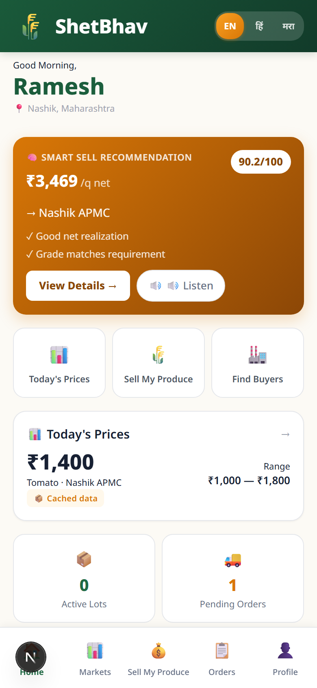
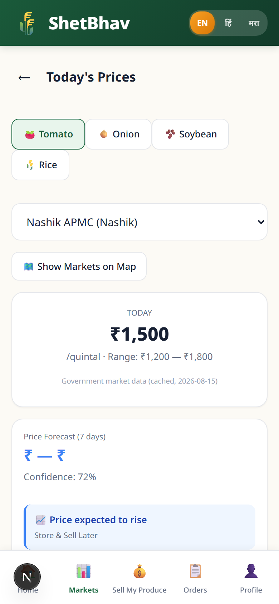
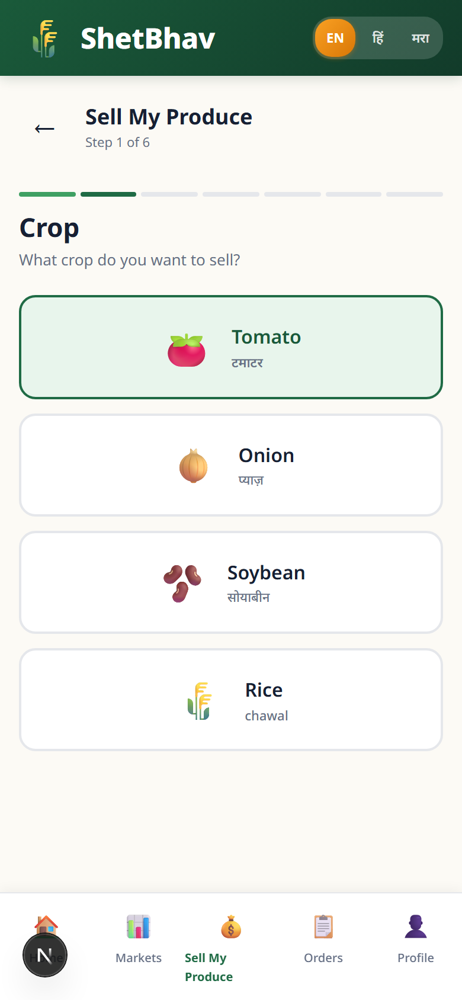
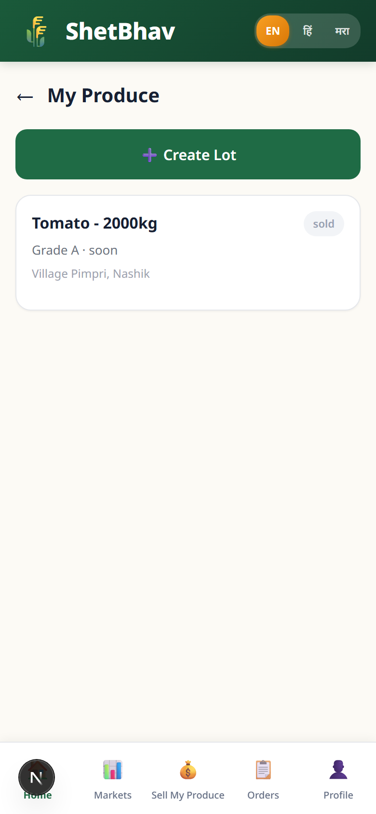
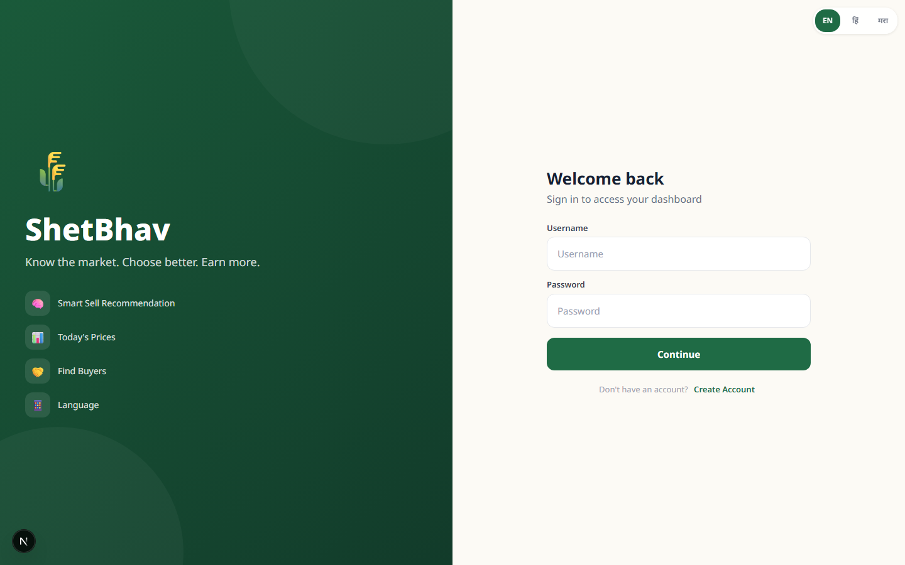
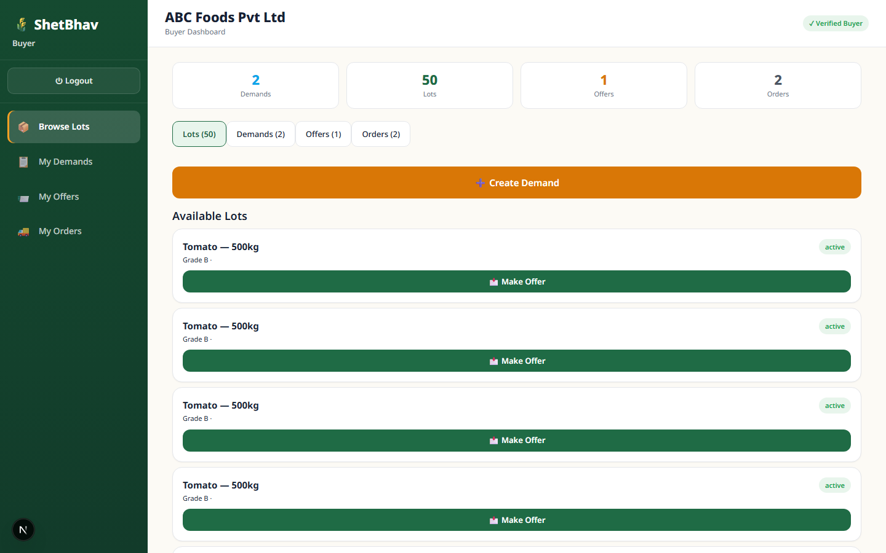
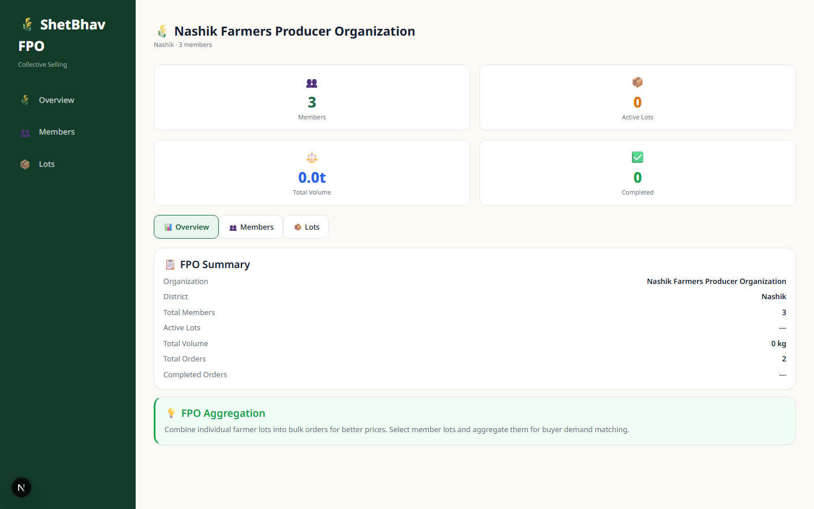
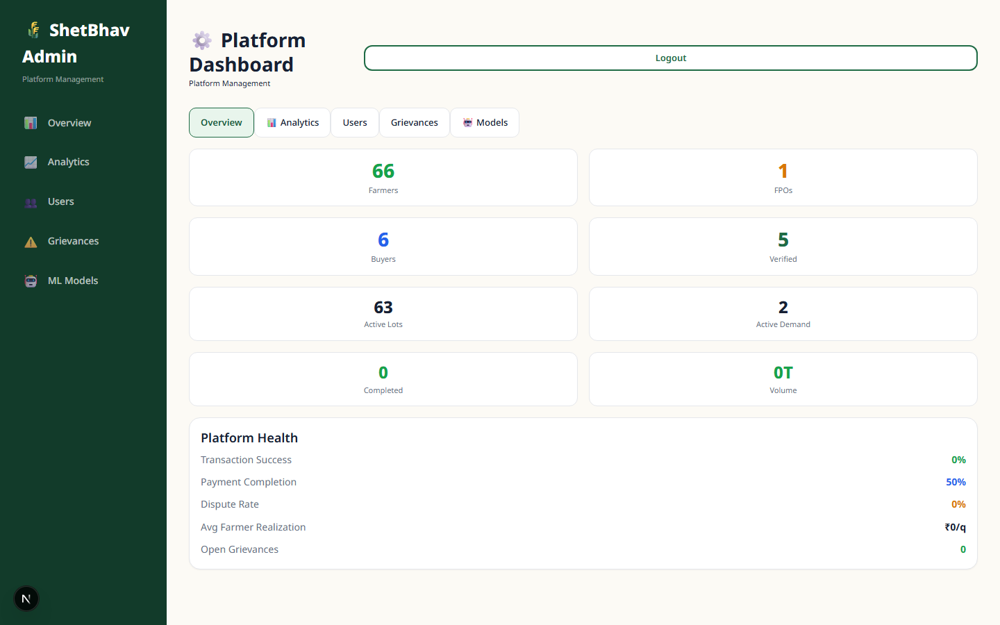

# ShetBhav (शेतभाव)

**Know the market. Choose better. Earn more.**

A market intelligence platform that helps Indian farmers decide where, when, and to whom to sell their produce. Built for [Smart India Hackathon 2026 — SIH26132](https://www.sih.gov.in/).

[](https://www.sih.gov.in/)
[](https://www.python.org/)
[](https://nextjs.org/)
[](#testing)

<details>
<summary>📑 Table of contents</summary>

- [Live demo](#live-demo)
- [What this does](#what-this-does)
- [A quick look](#a-quick-look)
- [Tech stack](#tech-stack)
- [Running locally](#running-locally)
- [Project structure](#project-structure)
- [How Smart Sell works](#how-smart-sell-works)
- [Where the market data comes from](#where-the-market-data-comes-from)
- [Testing](#testing)
- [Deployment](#deployment)
- [Documentation](#documentation)
- [What's real vs. what's simulated](#whats-real-vs-whats-simulated)
- [Limitations](#limitations)
- [License](#license)

</details>

---

## Live Demo

🔗 **[market-intelligence-for-farmer.vercel.app](https://market-intelligence-for-farmer.vercel.app/)**

| Role | Username | Password |
|------|----------|----------|
| 👨‍🌾 Farmer | `ramesh` | `demo123` |
| 🏭 Buyer | `abc_foods` | `demo123` |
| ⚙️ Admin | `admin` | `demo123` |
| 🌾 FPO | `nashik_fpo` | `demo123` |

---

## What This Does

Farmers in Maharashtra often sell their produce at whichever mandi is nearest, without knowing if there's a better price at another market or a buyer willing to pay more. ShetBhav changes that.

The platform pulls **real daily mandi prices** from the official data.gov.in API (AGMARKNET data), compares them against buyer demand and transport costs, and gives farmers a clear recommendation on the best way to sell their specific crop lot.

The full flow works end-to-end:

```
Farmer creates crop lot
  → views mandi prices and buyer demand
  → Smart Sell engine compares selling options
  → buyer makes an offer
  → farmer negotiates or accepts
  → order is created
  → transport is assigned
  → delivery is tracked
  → simulated payment is shown
  → farmer can raise a grievance if something goes wrong
```

---

## A Quick Look

Farmers use the app on their phones — one screen at a time, in their own language. Below are real screenshots from the running app:

| 👨‍🌾 Farmer home | 📊 Market prices | 💰 Smart Sell wizard | 🧺 My crop lots |
|---|---|---|---|
|  |  |  |  |

- **Farmer home** — greeting, a Smart Sell card with estimated income, nearby mandi prices, and active crop lots.
- **Smart Sell** — a guided step-by-step wizard that compares selling at the mandi, to a verified buyer, after storage, or through an FPO.
- **Market prices** — official daily mandi data with source and freshness badges, in cards sized for a phone.

Buyers, FPOs, and admins work on desktop — dashboards with stats, tables, and charts:

| 🔐 Login | 🏭 Buyer dashboard | 🌾 FPO dashboard | ⚙️ Admin dashboard |
|---|---|---|---|
|  |  |  |  |

Everything on the platform works in **English, Hindi (हिन्दी), and Marathi (मराठी)** — farmers can switch languages at any time.

---

## Tech Stack

| Layer | What |
|-------|------|
| Frontend | Next.js 16, TypeScript, Tailwind CSS, Zustand, Recharts, Leaflet |
| Backend | FastAPI, Python 3.11, SQLAlchemy ORM |
| Database | SQLite (local dev), PostgreSQL (production) |
| ML | XGBoost, scikit-learn, pandas, joblib |
| Market Data | data.gov.in AGMARKNET API |
| Maps | Leaflet + OpenStreetMap |
| Auth | JWT + bcrypt, 4 roles |
| Deploy | Vercel (frontend), Render (backend + database) |

---

## Running Locally

**Prerequisites:** Node.js 18+, Python 3.11+

```bash
# Backend
cd shetbhav/backend
pip install -r requirements.txt
python -m uvicorn app.main:app --reload --port 8000

# Frontend (new terminal)
cd shetbhav/frontend
npm install
npm run dev
```

Open **http://localhost:3000**, go to **/login**, and sign in with any demo account listed in the table above (username + password `demo123`, then select the matching role).

---

## Project Structure

```
shetbhav/
├── backend/          FastAPI + Python 3.11 (73 API paths)
│   ├── app/          Entry point and route mounting
│   ├── services/     Smart Sell, auth, market data, logistics, quality
│   ├── ml/           XGBoost forecast pipeline + evaluation
│   ├── models/       43 SQLAlchemy tables + Pydantic schemas
│   ├── tests/        175 pytest tests
│   └── data/         Imported AGMARKNET dataset sample
└── frontend/         Next.js 16 + TypeScript (19 routes)
    └── src/
        ├── app/      Pages: farmer, buyer, fpo, admin, auth
        ├── components/  Shared UI components
        └── lib/      API client, auth store, i18n
```

Jump straight in: [`shetbhav/backend`](shetbhav/backend) · [`shetbhav/frontend`](shetbhav/frontend) · [ARCHITECTURE.md](shetbhav/ARCHITECTURE.md) · [API.md](shetbhav/API.md) · [`render.yaml`](render.yaml) (backend blueprint) · [`vercel.json`](shetbhav/frontend/vercel.json) (frontend config)

---

## How Smart Sell Works

The core feature. It scores 8 factors to recommend the best selling option:

| Factor | Weight | What it measures |
|--------|--------|-----------------|
| Net realisation | 30% | Income after transport, storage, handling, and spoilage costs |
| Price advantage | 15% | How the offer compares to mandi modal price |
| Transport cost | 10% | Distance and vehicle type |
| Buyer demand | 10% | Active buyer interest for this crop |
| Quality match | 10% | Whether lot quality meets buyer requirements |
| Payment reliability | 10% | Buyer's track record on the platform |
| Timing | 10% | How urgently the farmer needs to sell |
| Distance | 5% | Physical distance to buyer or mandi |

The 7-day price forecast (XGBoost) is used as one input — it never alone decides the recommendation.

---

## Where the Market Data Comes From

The app connects to the **official data.gov.in AGMARKNET API** for daily mandi prices in Maharashtra (Onion, Tomato, Soybean).

Every price card in the UI shows where the data came from:

| Badge | Meaning |
|-------|---------|
| 🟢 Official daily data | Fetched from data.gov.in API |
| 🟡 Cached official data | Previously fetched, still fresh |
| 🔴 Demo data | Synthetic fallback, clearly labeled |

---

## Testing

```bash
cd shetbhav/backend
python -m pytest tests/ -v    # 175 tests across 6 files
```

Test categories:
- **test_api.py** — Auth, CRUD, role-based access (47 tests)
- **test_smart_sell.py** — Smart Sell scoring engine (15 tests)
- **test_workflows.py** — End-to-end transaction flows (27 tests)
- **test_forecasting.py** — XGBoost pipeline, baselines, chronological validation (47 tests)
- **test_data_gov.py** — data.gov.in API integration (15 tests)
- **test_quality_grading.py** — AI quality assessment (24 tests)

Frontend:
```bash
cd shetbhav/frontend
npm run build    # 19 routes, 0 errors
```

---

## Deployment

| Service | Platform | URL |
|---------|----------|-----|
| Frontend | [Vercel](https://vercel.com) | [market-intelligence-for-farmer.vercel.app](https://market-intelligence-for-farmer.vercel.app/) |
| Backend | [Render](https://render.com) | [shetbhav-backend.onrender.com](https://shetbhav-backend.onrender.com/) |
| Database | Render PostgreSQL | Auto-wired by Blueprint |

Both services auto-deploy on every push to `main`.

---

## Documentation

| File | What's in it |
|------|-------------|
| [ARCHITECTURE.md](./shetbhav/ARCHITECTURE.md) | System design and data flow |
| [DESIGN.md](./shetbhav/DESIGN.md) | Design system: colors, typography, spacing, components, accessibility |
| [SECURITY.md](./shetbhav/SECURITY.md) | Secret handling, auth, and security notes |
| [API.md](./shetbhav/API.md) | Full API reference |
| [ML.md](./shetbhav/ML.md) | Forecasting pipeline and model details |
| [DATA_SOURCES.md](./shetbhav/DATA_SOURCES.md) | data.gov.in integration and AGMARKNET dataset |
| [TESTING.md](./shetbhav/TESTING.md) | Test results and categories |
| [LIMITATIONS.md](./shetbhav/LIMITATIONS.md) | Honest scope assessment |
| [DEMO.md](./shetbhav/DEMO.md) | Presentation walkthrough |
| [PROJECT_STATUS.md](./shetbhav/PROJECT_STATUS.md) | Current status |
| [LICENSE](./LICENSE) | MIT license |

---

## What's Real vs. What's Simulated

| Feature | Status |
|---------|--------|
| Mandi prices | ✅ Real data from data.gov.in API |
| Smart Sell recommendations | ✅ Working with real calculations |
| Price forecasting | ✅ Real-data evaluation — XGBoost vs naive baseline, auto-fallback |
| Lot creation and matching | ✅ Full CRUD with buyer matching |
| Offer negotiation | ✅ Counter-offer history preserved |
| Order tracking | ✅ Event timeline |
| Quality grading | ⚠️ Rule-based prototype, not lab-certified |
| Payments | 🔴 Simulated — labeled "Demo payment tracking" |
| Transport tracking | ⚠️ Estimated quotes, not live GPS |
| Buyer verification | ⚠️ Based on platform history only |

---

## Limitations

- Maharashtra only, 3 crops (Onion, Tomato, Soybean)
- Daily mandi data, not real-time second-by-second
- Forecasts are estimates, not guaranteed prices
- No real money moves — payments are clearly labeled as demo
- AI grading is a prototype, not certified lab testing
- Buyer reliability is based on observed platform behavior

---

## License

MIT License — see [LICENSE](./LICENSE).

Built for Smart India Hackathon 2026 (problem SIH26132).
