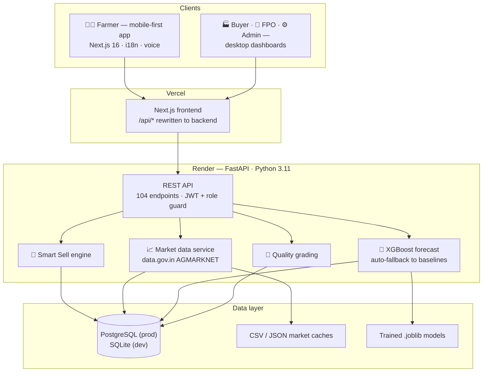
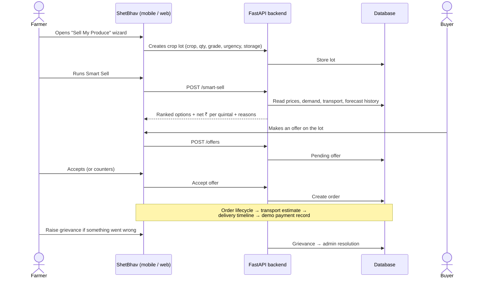

# ShetBhav (शेतभाव)

**Know the market. Choose better. Earn more.**

A market-intelligence platform that helps Indian farmers decide **where, when, and to whom** to sell their produce — with real mandi prices, buyer demand, and a Smart Sell engine that ranks every selling option by net income. Built for [Smart India Hackathon 2026 — SIH26132](https://www.sih.gov.in/).

[](https://www.sih.gov.in/)
[](https://www.python.org/)
[](https://fastapi.tiangolo.com/)
[](https://nextjs.org/)
[](https://www.typescriptlang.org/)
[](#testing--ci)
[](#license)

---

<details>
<summary>📑 Table of contents</summary>

- [What is ShetBhav?](#what-is-shetbhav)
- [Live demo](#live-demo)
- [Screenshots](#screenshots)
- [Key features](#key-features)
- [Architecture](#architecture)
- [How a sale flows end-to-end](#how-a-sale-flows-end-to-end)
- [Tech stack](#tech-stack)
- [Running locally](#running-locally)
- [Environment variables](#environment-variables)
- [Project structure](#project-structure)
- [Testing & CI](#testing--ci)
- [Deployment](#deployment)
- [Documentation](#documentation)
- [What's real vs. what's simulated](#whats-real-vs-whats-simulated)
- [License](#license)

</details>

---

## What is ShetBhav?

Farmers in Maharashtra often sell at whichever mandi is nearest, without knowing whether another market or a buyer would pay more. ShetBhav changes that:

1. It pulls **official daily mandi prices** from the government's data.gov.in AGMARKNET feed.
2. The farmer lists a **crop lot** (crop, quantity, grade, storage, urgency).
3. The **Smart Sell engine** scores every option — sell at the mandi, to a verified buyer, after storage, or via an FPO — by *net* income after transport, storage, and handling.
4. Buyers see matching lots and make offers; farmers negotiate, accept, and the platform manages the order, transport estimate, and payment tracking.

Everything works in **English, Hindi (हिन्दी), and Marathi (मराठी)**, with distinct experiences for each role:

| Role | Experience |
|---|---|
| 👨‍🌾 Farmer | Mobile-first app: prices, Smart Sell wizard, lots, orders, earnings, AI-grade photos, grievances |
| 🏭 Buyer | Desktop dashboard: browse lots, post demands, make/counter offers, orders |
| 🌾 FPO | Collective dashboard: members, aggregated lots, volumes |
| ⚙️ Admin | Platform dashboard: users, grievances, ML model status, analytics |

---

## Live Demo

🔗 **[market-intelligence-for-farmer.vercel.app](https://market-intelligence-for-farmer.vercel.app/)** — backend: [shetbhav-backend.onrender.com](https://shetbhav-backend.onrender.com/)

| Role | Username | Password |
|------|----------|----------|
| 👨‍🌾 Farmer | `ramesh` | `demo123` |
| 🏭 Buyer | `abc_foods` | `demo123` |
| 🌾 FPO | `nashik_fpo` | `demo123` |
| ⚙️ Admin | `admin` | `demo123` |

> Sign in, keep the pre-selected role, and click **Sign In**. All demo accounts are seeded automatically on first boot.

---

## Screenshots

Fresh captures from the running app (Sept 2026). Farmers get a phone-first flow; buyers, FPOs, and admins get desktop dashboards.

**📱 Farmer — mobile**
| Home & Smart Sell | Market prices | Sell wizard | My lots |
|---|---|---|---|
|  |  |  |  |

**🖥️ Role dashboards — desktop**

| Login | Buyer | FPO | Admin |
|---|---|---|---|
|  |  |  |  |

---

## Key features

- **Smart Sell engine** — ranks mandi sale, buyer offer, storage-and-sell-later, and FPO aggregation by net ₹/quintal (after transport, storage, handling), with reasons and a confidence score.
- **Real mandi prices** — official AGMARKNET data with freshness/source badges on every price card, plus a 7-day XGBoost price forecast (with automatic baseline fallback when history is thin).
- **Full marketplace flow** — lots → offers → counter-offers → orders → delivery timeline → (simulated, clearly labeled) payments.
- **FPO membership & aggregation** — farmers browse/join/leave an FPO (self-service, with admin approval); the FPO approves or removes members, views each member's contact info and lots, combines opted-in lots into one collective lot for buyer demand, and splits payment back to contributors by their quantity share (net of commission).
- **AI quality grading (prototype)** — photo-based grade assessment with manual override.
- **3 languages** — English, हिन्दी, मराठी switchable live.
- **JWT auth with 4 roles** — farmer, buyer, FPO, admin; role-based API access enforced on every endpoint.
- **Leaflet map of mandis** — pick markets visually on a Maharashtra map.
- **shadcn/ui component system** — the entire UI (24 pages) is built on shadcn/ui (Base UI) primitives mapped onto ShetBhav's own green/saffron brand tokens, not a generic theme.

---

## Architecture



The frontend calls the FastAPI backend through a Vercel `/api/*` rewrite in production, or `http://localhost:8000` in development. All business logic (recommendations, scoring, normalization, forecasts) lives server-side so numbers shown to farmers are computed once, consistently.

---

## How a sale flows end-to-end



---

## Tech stack

| Layer | Technology |
|---|---|
| Frontend | Next.js 16 (App Router), TypeScript, Tailwind v4, shadcn/ui (Base UI), Zustand, Leaflet, Recharts |
| Backend | FastAPI, Python 3.11, SQLAlchemy 2.0 (45 tables) |
| Database | SQLite (local) / PostgreSQL (production) |
| ML | XGBoost, scikit-learn, pandas, joblib (forecasting + quality grading) |
| Market data | data.gov.in AGMARKNET API + bundled historical sample |
| Auth | JWT (HS256) + bcrypt; 4 roles |
| Deploy | Vercel (frontend), Render (backend + DB), GitHub Actions (CI) |

---

## Running locally

**Prerequisites:** Node.js 18+ and Python 3.11+.

```bash
# 1) Backend — http://localhost:8000
cd shetbhav/backend
python -m venv .venv && source .venv/bin/activate   # Windows: .venv\Scripts\activate
pip install -r requirements.txt
python -m uvicorn app.main:app --reload --port 8000
```

```bash
# 2) Frontend — http://localhost:3000
cd shetbhav/frontend
npm install
npm run dev
```

Open **http://localhost:3000** → **/login** → use any demo account above.

On first boot the backend **creates the schema, seeds the four demo accounts, and fills crops/markets/demo records automatically** (every startup also idempotently adds any missing reference data — crops, markets, coordinates). No database setup needed for the demo. To import the real AGMARKNET history and train forecast models on it, set `IMPORT_HISTORICAL_CSV=true` and `TRAIN_ON_STARTUP=true` on a fresh database (see [ML.md](shetbhav/ML.md)).

---

## Environment variables

Backend — copy [`shetbhav/backend/.env.example`](shetbhav/backend/.env.example) to `.env`:

| Variable | Default | Purpose |
|---|---|---|
| `DATABASE_URL` | `sqlite:///./data/shetbhav.db` | SQLite local; Postgres URL in production |
| `SECRET_KEY` | dev value | JWT signing — **change in production** |
| `FRONTEND_URL` / `BACKEND_URL` | localhost | CORS allow-list |
| `DEMO_MODE` | `true` | disables rate limiting & strict headers; **set `false` in prod** |
| `DATA_GOV_API_KEY` | — | data.gov.in key (empty → labelled synthetic fallback) |
| `IMPORT_HISTORICAL_CSV` | `false` | bootstrap real AGMARKNET history once |
| `TRAIN_ON_STARTUP` | `false` | train/evaluate XGBoost models on startup |

Frontend — optional `NEXT_PUBLIC_API_URL` (defaults to `http://localhost:8000`; the deployed app uses the Vercel `/api` rewrite).

---

## Project structure

```
market-intelligence-for-farmer/
├── README.md                 ← this file
├── LICENSE                   MIT
├── render.yaml               Render Blueprint (backend + PostgreSQL)
├── screenshots/              Real UI captures used above
├── .github/workflows/ci.yml  Backend suite + frontend build/lint/typecheck + Playwright E2E
└── shetbhav/
    ├── backend/
    │   ├── app/main.py           FastAPI app (104 endpoints, startup seeding)
    │   ├── app/scripts/          Market-data CSV import tool
    │   ├── scripts/               Manual E2E demo script (scripts/e2e_demo.py)
    │   ├── config/               Settings + DB engine
    │   ├── services/             Smart Sell · market data · auth · logistics · quality · notifications
    │   ├── ml/                   XGBoost pipeline, baselines, evaluation
    │   ├── models/               SQLAlchemy models + Pydantic schemas
    │   ├── tests/                14 files · 246 pytest tests
    │   ├── data/                 Sample AGMARKNET CSV (20 KB)
    │   └── .env.example
    └── frontend/
        ├── src/app/             24 routes (incl. dynamic [id]/[userId]): farmer/*, buyer, fpo, admin, login, register
        ├── src/components/ui/   shadcn/ui primitives (Button, Card, Tabs, Dialog, Carousel, ...)
        ├── src/components/       App-specific shared UI (headers, nav, map, notifications)
        ├── src/lib/              API client · auth store · i18n (EN/HI/MR)
        ├── e2e/                  Playwright E2E specs (15 tests)
        ├── public/
        ├── vercel.json          /api rewrite → Render backend
        └── package.json
```

---

## Testing & CI

```bash
cd shetbhav/backend
python -m pytest tests/ -q        # 246 passed
```

| File | Covers |
|---|---|
| `test_api.py` | Auth, CRUD, role-based access control |
| `test_smart_sell.py` | Smart Sell scoring engine |
| `test_workflows.py` | End-to-end marketplace transactions |
| `test_forecasting.py` | XGBoost pipeline, baselines, validation |
| `test_data_gov.py` | AGMARKNET integration, key handling, normalization |
| `test_quality_grading.py` | AI quality assessment |
| `test_fpo_flow.py` | FPO join/leave/aggregation-with-confirmation/payment distribution |
| `test_booking.py`, `test_demand_direct_response.py` | Direct book/demand-response flows |
| `test_offers_notifications.py` | Offer negotiation, notification delivery |
| `test_payment_deadline.py` | Payment-window enforcement |
| `test_lot_edit_delete.py`, `test_profiles_and_admin.py` | Lot edit/withdraw, profile + admin endpoints |

Frontend: `npm run build` compiles all 24 routes cleanly, and `npx playwright test` (from `shetbhav/frontend`, both servers running) runs 15 browser-driven E2E tests covering the full book-and-pay loop, counterparty detail pages, and the Smart Sell/My Lots handoff. CI runs the backend suite, frontend build/typecheck/lint, and the Playwright suite on every push (see [`.github/workflows/ci.yml`](.github/workflows/ci.yml)).

---

## Deployment

| Service | Platform | Notes |
|---|---|---|
| Frontend | [Vercel](https://vercel.com) | `market-intelligence-for-farmer.vercel.app` |
| Backend | [Render](https://render.com) | `shetbhav-backend.onrender.com` (+ PostgreSQL) |

Both auto-deploy from `main`. **Vercel monorepo note:** the app lives at `shetbhav/frontend`, so the Vercel project's **Root Directory must be set to `shetbhav/frontend`** (Project Settings → General). If it points at the repo root, deploys fail and the last good build stays live.

---

## Documentation

| File | Contents |
|---|---|
| [ARCHITECTURE.md](shetbhav/ARCHITECTURE.md) | System design, data flow, security model |
| [API.md](shetbhav/API.md) | REST API reference |
| [ML.md](shetbhav/ML.md) | Forecasting pipeline & model evaluation |
| [DESIGN.md](shetbhav/DESIGN.md) | Design system & accessibility |
| [DATA_SOURCES.md](shetbhav/DATA_SOURCES.md) | AGMARKNET integration |
| [SECURITY.md](shetbhav/SECURITY.md) | Secrets, auth, threat notes |
| [TESTING.md](shetbhav/TESTING.md) | Test matrix & results |
| [DEMO.md](shetbhav/DEMO.md) | Presentation walkthrough |
| [PROJECT_STATUS.md](shetbhav/PROJECT_STATUS.md) | Status & roadmap |
| [LIMITATIONS.md](shetbhav/LIMITATIONS.md) | Honest scope assessment |

---

## What's real vs. what's simulated

| Feature | Status |
|---|---|
| Mandi prices | ✅ Real data via data.gov.in API (labelled fallback without a key) |
| Smart Sell recommendations | ✅ Real calculations on real inputs |
| Price forecasting | ✅ XGBoost vs baseline, auto-fallback when history is thin |
| Marketplace (lots → offers → orders) | ✅ Full flow with negotiation history |
| FPO aggregation | ✅ Member lots combined for bulk demand |
| Quality grading | ⚠️ Rule-based prototype, not lab-certified |
| Payments | 🔴 Simulated — labeled "Demo payment tracking" |
| Transport tracking | ⚠️ Estimated quotes, not live GPS |

---

## License

MIT — see [LICENSE](./LICENSE). Built for Smart India Hackathon 2026 (problem SIH26132).
