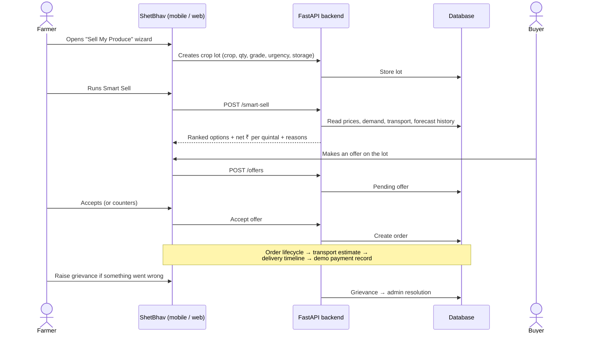

# ShetBhav (शेतभाव)

**Know the market. Choose better. Earn more.**

A market-intelligence platform that helps Indian farmers decide **where, when, and to whom** to sell their produce — with real mandi prices, buyer demand, and a Smart Sell engine that ranks every selling option by net income. Built for [Smart India Hackathon 2026 — SIH26132](https://www.sih.gov.in/).

[](https://www.sih.gov.in/)
[](https://www.python.org/)
[](https://fastapi.tiangolo.com/)
[](https://nextjs.org/)
[](https://www.typescriptlang.org/)
[](#testing--ci)
[](#license)

---

<details>
<summary>📑 Table of contents</summary>

- [What is ShetBhav?](#what-is-shetbhav)
- [Live demo](#live-demo)
- [Screenshots](#screenshots)
- [Key features](#key-features)
- [Architecture](#architecture)
- [How a sale flows end-to-end](#how-a-sale-flows-end-to-end)
- [Tech stack](#tech-stack)
- [Running locally](#running-locally)
- [Environment variables](#environment-variables)
- [Project structure](#project-structure)
- [Testing & CI](#testing--ci)
- [Deployment](#deployment)
- [Documentation](#documentation)
- [What's real vs. what's simulated](#whats-real-vs-whats-simulated)
- [License](#license)

</details>

---

## What is ShetBhav?

**ShetBhav (शेतभाव)** — *Know the market. Choose better. Earn more.*

An AI-powered market-intelligence platform that helps Indian farmers decide **where, when, and to whom** to sell their produce. Built for [Smart India Hackathon 2026 — SIH26132](https://www.sih.gov.in/).

Farmers in Maharashtra often sell at whichever mandi is nearest, without knowing whether another market or a buyer would pay more. ShetBhav changes that:

1. **Official Market Data**: Pulls daily mandi prices from the government's data.gov.in AGMARKNET feed with full source transparency.
2. **Smart Sell Engine**: AI-powered recommendation engine that scores every selling option by *net* income after transport, storage, handling, and spoilage costs.
3. **Full Marketplace**: Farmers list crop lots → buyers make offers → negotiate → accept → order management → simulated payments.
4. **FPO Aggregation**: Farmers can join FPOs, and FPOs can aggregate member lots for bulk buyer demands with automatic payment distribution.
5. **AI Quality Grading**: Prototype computer-vision based quality assessment for Tomato, Onion, and Soybean.
6. **Price Forecasting**: XGBoost-based 7-day price predictions with automatic fallback to baselines when data is thin.

Everything works in **English, Hindi (हिंदी), and Marathi (मराठी)**, with distinct experiences for each role:

| Role | Experience |
|---|---|
| 👨‍🌾 **Farmer** | Mobile-first app: prices, Smart Sell wizard (6 steps), lots management, orders tracking, earnings, AI-grade photos, grievances, FPO membership |
| 🏭 **Buyer** | Desktop dashboard: browse lots (farmers/FPOs), post demands, make/counter offers, orders, payments, profile management |
| 🌾 **FPO** | Collective dashboard: overview stats, members (approve/reject/remove), lots, available-lots aggregation, demands fulfilment, payment distribution |
| ⚙️ **Admin** | Platform dashboard: users, buyer verification, grievances resolution, ML model status, platform analytics, market data sync |

---

## Live Demo

🔗 **Frontend**: [market-intelligence-for-farmer.vercel.app](https://market-intelligence-for-farmer.vercel.app/)
🔗 **Backend**: [shetbhav-backend.onrender.com](https://shetbhav-backend.onrender.com/)
🔗 **API Docs**: [shetbhav-backend.onrender.com/docs](https://shetbhav-backend.onrender.com/docs)

### Demo Accounts

All demo accounts use password: `demo123`

| Role | Username | Dashboard | Description |
|------|----------|-----------|-------------|
| 👨‍🌾 **Farmer** | `ramesh` | `/farmer` | Ramesh Patil — Nashik farmer with active lots and earnings |
| 🏭 **Buyer** | `abc_foods` | `/buyer` | ABC Foods — verified buyer with demands and orders |
| 🌾 **FPO** | `nashik_fpo` | `/fpo` | Nashik FPO — farmer producer organization with members |
| ⚙️ **Admin** | `admin` | `/admin` | Platform administrator with full management access |

### Quick Start

1. Open [market-intelligence-for-farmer.vercel.app](https://market-intelligence-for-farmer.vercel.app/)
2. Click **Login** (or go to `/login`)
3. Enter username (e.g., `ramesh`) and password (`demo123`)
4. Click **Sign In** — role is auto-detected, no need to select
5. Explore the dashboard for your role

### Demo Data Summary

| Entity | Count |
|--------|-------|
| Farmers | 7 |
| Buyers | 5 |
| FPOs | 1 |
| Markets | 5 (Maharashtra APMCs) |
| Crops | 3 (Tomato, Onion, Soybean) + Rice (reference) |
| Active lots | 7 |
| Active demands | 5 |
| Offers | 6 |
| Orders | 4 |
| Payments | 3 (simulated) |
| Grievances | 4 |
| ML models | 3 (trained, baseline-fallback mode) |
| Market price records | 863 (770 historical + 93 live) |

---

## Screenshots

Fresh captures from the running app (Sept 2026). Farmers get a phone-first flow; buyers, FPOs, and admins get desktop dashboards.

**📱 Farmer — mobile**
| Home & Smart Sell | Market prices | Sell wizard | My lots |
|---|---|---|---|
|  |  |  |  |

**🖥️ Role dashboards — desktop**

| Login | Buyer | FPO | Admin |
|---|---|---|---|
|  |  |  |  |

---

## Key features

### 🎯 Smart Sell Decision Engine
- **6-step wizard**: Crop → Quantity → Quality → Urgency → Storage → Location → Results
- **Multi-factor scoring** (8 factors weighted): Net realisation (30%), Price advantage (15%), Transport cost (10%), Buyer demand (10%), Quality match (10%), Payment reliability (10%), Timing (10%), Distance (5%)
- **Best option + 6 alternatives + 3 What-If scenarios**
- **Net realization calculation**: Gross price − transport − storage − handling − spoilage − charges
- **Confidence scores** and plain-language reasons/risks for each option

### 📊 Real Market Intelligence
- **Official AGMARKNET data** from data.gov.in with source badges (live/cached/imported/synthetic)
- **7-day XGBoost price forecast** with automatic baseline fallback when history is thin
- **Price trends** (up/down/stable) with percentage change
- **Leaflet map** of Maharashtra mandis for visual market selection
- **863 real market price records** (770 imported + 93 live)

### 🤝 Full Marketplace Flow
- **Lots**: Create, edit, withdraw crop lots with price, quality, urgency, storage options
- **Offers**: Buyers propose prices → farmers accept/counter/reject
- **Negotiation**: Counter-offers preserved in history (nothing overwritten)
- **Orders**: Full lifecycle — created → accepted → pickup → in-transit → delivered → quality confirmed → paid → completed
- **Payments**: Simulated (clearly labeled "Demo payment tracking") with payment deadline enforcement
- **Grievances**: File and track disputes with admin resolution

### 🏢 FPO Features
- **Membership lifecycle**: Farmers browse/join/leave FPOs (self-service with approval)
- **Member management**: FPO approves/rejects join requests, removes members, views member details
- **Aggregation**: Combine member lots into collective lots for bulk buyer demands
- **Payment distribution**: Split payments to contributor farmers by quantity share (net of FPO commission + platform fee)

### 🧪 AI Quality Grading (Prototype)
- **Crop support**: Tomato, Onion, Soybean
- **Image analysis**: Color, uniformity, blemish, freshness detection
- **Grade output**: A/B/C with confidence score
- **Verification types**: Self-declared, AI-assisted, manually verified, lab-verified
- **Always labeled** "AI-assisted estimate" — never "certified grade"

### 🌐 Multilingual & Accessible
- **3 languages**: English, Hindi (हिंदी), Marathi (मराठी) — switchable live
- **Mobile-first design**: Farmer app centered at 420px on desktop too
- **48px minimum touch targets** (WCAG compliant)
- **Colorblind-safe**: Status always includes icon + label
- **High contrast**: Navy on cream (13:1), white on green (6.4:1)

### 🔐 Security & Auth
- **JWT authentication** with 4 roles (farmer, buyer, FPO, admin)
- **Role-based access control** enforced on every API endpoint
- **bcrypt password hashing**
- **Rate limiting** (disabled in demo mode)
- **Security headers**: X-Content-Type-Options, X-Frame-Options, X-XSS-Protection

### 🎨 UI Component System
- **shadcn/ui** (Base UI) primitives: Button, Card, Badge, Input, Tabs, Dialog, Carousel, Avatar, Skeleton, Sonner
- **Custom brand tokens**: Green/saffron/navy palette via CSS custom properties
- **24 routes** (including dynamic [id]/[userId] routes)
- **Responsive**: Mobile-first farmer shell, desktop sidebar for business roles

---

## Architecture

### System Overview

ShetBhav is a full-stack web application with a Python backend and Next.js frontend.

```
┌────────────────────────────────────────────────┐
│                   Frontend                     │
│  Next.js 16 · TypeScript · Tailwind v4         │
│  shadcn/ui (Base UI) · Zustand · Axios         │
│  24 routes (incl. dynamic) · EN/HI/MR i18n     │
│  Mobile-first (farmer) + desktop (business)    │
└───────────────────┬────────────────────────────┘
                    │ REST API (JSON + JWT)
┌───────────────────▼────────────────────────────┐
│                   Backend                      │
│  FastAPI · Python 3.11 · Pydantic              │
│  104 API endpoints · JWT auth · RBAC           │
│  8 service modules · 1 ML pipeline             │
└───────────────────┬────────────────────────────┘
                    │
┌───────────────────▼────────────────────────────┐
│                 Database                       │
│  SQLite (dev) · PostgreSQL (Render prod)       │
│  45 tables · SQLAlchemy ORM                    │
│  Referential integrity · Indexes               │
└────────────────────────────────────────────────┘
```

### Backend Architecture

**Service Modules (8):**
1. **Smart Sell** (`services/smart_sell.py`) — Multi-factor scoring engine comparing mandi, buyer, storage, and FPO options
2. **Market Data** (`services/market_data.py`) — Multi-mode adapter: live → cached → dataset → demo
3. **data.gov.in Client** (`services/data_gov.py`) — AGMARKNET API integration with validation/deduplication
4. **Forecasting** (`ml/forecasting.py`) — XGBoost price prediction with chronological validation
5. **Logistics** (`services/logistics.py`) — Haversine distance, transport/storage cost estimation
6. **FPO Aggregation** (`services/fpo_aggregation.py`) — Lot combination for bulk demands
7. **Quality Grading** (`services/quality_grading.py` + `ml/crop_vision.py`) — Rule-based CV analysis
8. **Auth** (`services/auth.py`) — JWT, bcrypt, role verification

**Data Flow:**
```
data.gov.in API (official daily mandi prices)
    ↓ validate, normalize, deduplicate
Database cache (market_price_records)
    ↓ FastAPI + Pydantic validation
Frontend (Next.js)
    ↓
Farmer sees price cards with source badges
```

**Authorization:**
- JWT tokens carry role claims
- `get_current_user` dependency validates tokens
- `require_role(FARMER, BUYER, ADMIN)` gates endpoints server-side

### Frontend Architecture

**Routing (24 routes):**
| Path | Role | Description |
|------|------|-------------|
| `/` | Public | Redirects to /login |
| `/login` | Public | Sign in with role selection |
| `/register` | Public | Create account (details → role) |
| `/farmer` | Farmer | Home dashboard with Smart Sell |
| `/farmer/sell` | Farmer | 6-step Smart Sell wizard |
| `/farmer/prices` | Farmer | Market prices + forecast + map |
| `/farmer/buyers` | Farmer | Buyer/FPO directory with map |
| `/farmer/demands` | Farmer | Buyer demands (accept/negotiate/reject) |
| `/farmer/offers` | Farmer | Ranked offers on lots |
| `/farmer/orders`, `/farmer/orders/[id]` | Farmer | Order tracking + detail |
| `/farmer/earnings` | Farmer | Payment history |
| `/farmer/lots` | Farmer | My produce lots (create/edit/delete) |
| `/farmer/fpo` | Farmer | Browse/join/leave FPOs |
| `/farmer/notifications` | Farmer | Full notification list |
| `/farmer/grievance` | Farmer | File/track grievances |
| `/farmer/profile` | Farmer | Profile + farm details + language |
| `/farmer/quality` | Farmer | AI quality grading |
| `/buyer` | Buyer | Dashboard: lots, demands, offers, orders, profile |
| `/fpo` | FPO | Overview, members, lots, demands, available-lots, payments |
| `/admin` | Admin | Platform management, users, grievances, analytics, ML status |
| `/lots/[id]`, `/demands/[id]` | Any | Counterparty-visible detail pages |
| `/profile/[userId]` | Any | Public counterparty profile |

**Component Layer:**
- **shadcn/ui primitives** (`src/components/ui/*.tsx`): Button, Card, Badge, Input, Tabs, Dialog, DropdownMenu, Carousel, Avatar, Skeleton, Sonner
- **App-specific** (`src/components/ui.tsx`): EmptyState, DataSourceBadge, PasswordInput, NotificationBell, NotificationsPanel, ProgressBar
- **Shared**: FarmerHeader, FarmerBottomNav, MapView, LangHydrator

**State Management:**
- **Zustand**: Auth store (user, token, login, logout, register, loadUser)
- **Zustand**: i18n store (lang, setLang, t)
- **localStorage**: Language persistence
- **sessionStorage**: Token storage

**Layouts:**
- **Farmer**: `.farmer-shell` (max 420px, centered on desktop), green header, bottom nav
- **Buyer/FPO/Admin**: `.role-app` (240px sidebar + topbar + content), collapses to bottom nav on mobile

---

## How a sale flows end-to-end



---

## Tech Stack

### Frontend

| Technology | Version | Purpose |
|------------|---------|--------|
| **Next.js** | 16.3.4 | App Router, React 19 framework |
| **TypeScript** | ^5 | Type safety |
| **Tailwind CSS** | ^4 | Utility-first styling (CSS-first config via @theme) |
| **shadcn/ui** | ^4.21.0 | UI primitives (Base UI, not Radix) |
| **@base-ui/react** | ^1.8.0 | Base UI primitives for shadcn |
| **@heroui/react** | ^3.2.4 | Additional component library |
| **Zustand** | ^5.0.15 | State management (auth, i18n) |
| **Axios** | ^1.20.0 | HTTP client with auth interceptors |
| **Leaflet** | ^1.9.4 | Map rendering (markets, buyers) |
| **react-leaflet** | ^5.0.0 | React wrapper for Leaflet |
| **embla-carousel-react** | ^8.6.0 | Carousel (price cards) |
| **class-variance-authority** | ^0.7.1 | Component variants |
| **lucide-react** | ^1.41.0 | Icons |
| **sonner** | ^2.0.8 | Toast notifications |
| **tw-animate-css** | (dev) | Tailwind v4 animation utilities |

### Backend

| Technology | Version | Purpose |
|------------|---------|--------|
| **FastAPI** | 0.141.1 | REST API framework |
| **Python** | 3.11+ | Runtime |
| **SQLAlchemy** | >=2.0 | ORM (45 tables) |
| **Pydantic** | >=2.0 | Data validation |
| **python-jose** | (crypto) | JWT signing (HS256) |
| **bcrypt** | >=4.0 | Password hashing |
| **uvicorn** | (standard) | ASGI server |
| **XGBoost** | (ml) | Price forecasting |
| **scikit-learn** | (ml) | ML utilities |
| **pandas** | (ml) | Data manipulation |
| **numpy** | (ml) | Numerical operations |
| **joblib** | (ml) | Model persistence |
| **Pillow** | >=10.0 | Image processing (quality grading) |
| **httpx** | (testing) | Async HTTP client |

### Database

| Environment | Database | Notes |
|-------------|----------|-------|
| **Development** | SQLite | `shetbhav/backend/data/shetbhav.db` |
| **Production** | PostgreSQL | Render-managed, auto-provisioned by Blueprint |

### Deployment

| Platform | Purpose |
|----------|--------|
| **Vercel** | Frontend hosting (auto-deploy from main) |
| **Render** | Backend + PostgreSQL (auto-deploy from main) |
| **GitHub Actions** | CI/CD (tests, build, lint, E2E) |

---

## Running locally

**Prerequisites:** Node.js 18+ and Python 3.11+.

```bash
# 1) Backend — http://localhost:8000
cd shetbhav/backend
python -m venv .venv && source .venv/bin/activate   # Windows: .venv\Scripts\activate
pip install -r requirements.txt
python -m uvicorn app.main:app --reload --port 8000
```

```bash
# 2) Frontend — http://localhost:3000
cd shetbhav/frontend
npm install
npm run dev
```

Open **http://localhost:3000** → **/login** → use any demo account above.

On first boot the backend **creates the schema, seeds the four demo accounts, and fills crops/markets/demo records automatically** (every startup also idempotently adds any missing reference data — crops, markets, coordinates). No database setup needed for the demo. To import the real AGMARKNET history and train forecast models on it, set `IMPORT_HISTORICAL_CSV=true` and `TRAIN_ON_STARTUP=true` on a fresh database (see [ML.md](shetbhav/ML.md)).

---

## Environment Variables

### Backend

Copy [`shetbhav/backend/.env.example`](shetbhav/backend/.env.example) to `.env`:

| Variable | Default | Purpose |
|----------|---------|--------|
| `DATABASE_URL` | `sqlite:///./data/shetbhav.db` | SQLite (dev) / PostgreSQL (prod) |
| `SECRET_KEY` | dev value | JWT signing — **change in production** |
| `FRONTEND_URL` | `http://localhost:3000` | CORS allow-list |
| `BACKEND_URL` | `http://localhost:8000` | Backend URL (used by frontend) |
| `DEMO_MODE` | `true` | Disables rate limiting & HSTS; **set false in prod** |
| `DATA_GOV_API_KEY` | (empty) | data.gov.in AGMARKNET API key |
| `DATA_GOV_RESOURCE_ID` | `9ef84268-d588-465a-a308-a864a43d0070` | AGMARKNET dataset resource ID |
| `MARKET_DATA_MODE` | `dataset` | Data source: live/cached/dataset/demo |
| `MARKET_DATA_CACHE_HOURS` | `24` | Cache freshness window |
| `REQUEST_TIMEOUT_SECONDS` | `30` | API request timeout |
| `IMPORT_HISTORICAL_CSV` | `false` | Bootstrap real AGMARKNET history on fresh DB |
| `TRAIN_ON_STARTUP` | `false` | Train/evaluate XGBoost models at startup |

### Frontend

| Variable | Default | Purpose |
|----------|---------|--------|
| `NEXT_PUBLIC_API_URL` | `http://localhost:8000` | Backend API URL (deployed app uses Vercel /api rewrite) |

### Security Notes

- **Never commit `.env`** — it's gitignored
- **`SECRET_KEY`** must be changed in production (JWT signing)
- **`DATA_GOV_API_KEY`** is optional — without it, data is labelled as synthetic/demo
- **`DEMO_MODE=true`** disables production hardening (rate limiting, HSTS) — set to `false` for production

---

## Project structure

```
market-intelligence-for-farmer/
├── README.md                      This file
├── LICENSE                        MIT
├── render.yaml                    Render Blueprint (backend + PostgreSQL)
├── screenshots/                   UI captures (8 images)
├── .github/workflows/ci.yml       CI: backend tests + frontend build/lint/typecheck + Playwright E2E
└── shetbhav/
    ├── backend/
    │   ├── app/
    │   │   ├── main.py            FastAPI app (104 endpoints, startup seeding, 3500+ lines)
    │   │   └── scripts/
    │   │       └── import_market_data.py  CSV import tool
    │   ├── config/
    │   │   ├── database.py        DB engine + init
    │   │   └── settings.py        Environment config
    │   ├── services/              8 service modules
    │   │   ├── auth.py            JWT, bcrypt, role guards
    │   │   ├── smart_sell.py      8-factor scoring engine
    │   │   ├── market_data.py     Multi-mode data adapter
    │   │   ├── data_gov.py        AGMARKNET API client
    │   │   ├── logistics.py       Haversine, transport/storage estimates
    │   │   ├── fpo_aggregation.py Lot combination for bulk demands
    │   │   ├── quality_grading.py Quality assessment service
    │   │   └── notifications.py   In-app notification system
    │   ├── ml/                    ML pipeline
    │   │   ├── forecasting.py     XGBoost prediction + baselines
    │   │   ├── crop_vision.py     Rule-based CV analysis
    │   │   ├── baselines.py       Naive + moving average baselines
    │   │   ├── evaluation.py      MAE, RMSE, MAPE metrics
    │   │   ├── feature_engineering.py Feature extraction
    │   │   ├── model_training.py  Model training + persistence
    │   │   └── model_registry.py  Model status tracking
    │   ├── models/
    │   │   ├── database.py        45 SQLAlchemy tables + enums
    │   │   └── schemas.py         Pydantic request/response schemas
    │   ├── tests/                 14 test files · 246 tests
    │   │   ├── test_api.py        Auth, CRUD, RBAC (47 tests)
    │   │   ├── test_smart_sell.py Scoring engine (16 tests)
    │   │   ├── test_workflows.py  End-to-end transactions (27 tests)
    │   │   ├── test_forecasting.py XGBoost pipeline (47 tests)
    │   │   ├── test_data_gov.py   AGMARKNET integration (15 tests)
    │   │   ├── test_quality_grading.py AI grading (24 tests)
    │   │   ├── test_fpo_flow.py   FPO membership/aggregation (13 tests)
    │   │   ├── test_booking.py    Direct book flow (10 tests)
    │   │   ├── test_demand_direct_response.py Demand fulfilment (8 tests)
    │   │   ├── test_offers_notifications.py Offers + notifications (13 tests)
    │   │   ├── test_payment_deadline.py Payment windows (5 tests)
    │   │   ├── test_lot_edit_delete.py Lot CRUD (8 tests)
    │   │   ├── test_profiles_and_admin.py Profiles + admin (13 tests)
    │   │   └── conftest.py        Test fixtures
    │   ├── data/
    │   │   ├── maharashtra_market_prices.csv  Sample AGMARKNET data
    │   │   └── models/            Trained .joblib models
    │   └── scripts/
    │       └── e2e_demo.py       Manual E2E demo script (22 steps)
    └── frontend/
        ├── src/
        │   ├── app/               24 routes (App Router)
        │   │   ├── layout.tsx     Root layout with metadata, fonts
        │   │   ├── page.tsx       Home (redirects to /login)
        │   │   ├── globals.css    Design system (Tailwind v4 + custom properties)
        │   │   ├── tw-animate.css Animated utilities (copied from tw-animate-css)
        │   │   ├── admin/         Admin dashboard
        │   │   ├── buyer/         Buyer dashboard (1 large file)
        │   │   ├── fpo/           FPO dashboard
        │   │   ├── login/         Login page (2-step: credentials → role)
        │   │   ├── register/      Registration (details → role)
        │   │   ├── farmer/         14 farmer pages
        │   │   │   ├── page.tsx           Home dashboard
        │   │   │   ├── sell/              Smart Sell wizard
        │   │   │   ├── prices/            Market prices + forecast
        │   │   │   ├── buyers/            Buyer/FPO directory
        │   │   │   ├── demands/           Buyer demands
        │   │   │   ├── offers/            Offers on lots
        │   │   │   ├── orders/            Order list + [id]/detail
        │   │   │   ├── earnings/          Payment history
        │   │   │   ├── lots/              My lots (create/edit/delete)
        │   │   │   ├── fpo/               FPO membership
        │   │   │   ├── notifications/     Notification list
        │   │   │   ├── grievance/         File/track grievances
        │   │   │   ├── profile/           Profile + farm details
        │   │   │   └── quality/           AI quality grading
        │   │   ├── favicon.ico
        │   │   ├── demands/[id]/  Demand detail (shared)
        │   │   ├── lots/[id]/     Lot detail (shared)
        │   │   └── profile/[userId]/ Counterparty profile (shared)
        │   ├── components/
        │   │   ├── ui/            shadcn/ui primitives (copied)
        │   │   │   ├── button.tsx, card.tsx, badge.tsx, input.tsx,
        │   │   │   ├── tabs.tsx, dialog.tsx, dropdown-menu.tsx,
        │   │   │   ├── carousel.tsx, avatar.tsx, skeleton.tsx,
        │   │   │   ├── sonner.tsx, select.tsx
        │   │   └── ui.tsx         App-specific components
        │   │   ├── FarmerHeader.tsx    Green sticky header
        │   │   ├── FarmerBottomNav.tsx Mobile bottom nav
        │   │   ├── LangHydrator.tsx    Language hydration
        │   │   └── MapView.tsx         Leaflet/OSM map
        │   └── lib/
        │       ├── api.ts         Axios client with auth interceptor
        │       ├── store.ts       Zustand auth store
        │       ├── i18n.ts        Zustand i18n (EN/HI/MR translations)
        │       ├── cropEmoji.ts   Crop → emoji mapping
        │       ├── money.ts       INR formatting + total calculation
        │       └── utils.ts       cn() utility
        ├── e2e/                   Playwright E2E specs (4 files · 15 tests)
        │   ├── transaction-loop.spec.ts   Full book-and-pay loop
        │   ├── counterparty-detail.spec.ts Lot/demand detail pages
        │   ├── lots-tab-create.spec.ts    My Lots direct create
        │   └── smart-sell-wizard.spec.ts  Smart Sell → My Lots handoff
        ├── public/                Static assets
        ├── vercel.json           /api rewrite → Render backend
        ├── next.config.ts        Next.js config
        ├── postcss.config.mjs    PostCSS + Tailwind v4
        ├── eslint.config.mjs     ESLint config
        ├── package.json          Dependencies
        └── tsconfig.json         TypeScript config
```

---

## Testing

### ✅ Current Test Status (Verified Sept 2026)

**Backend Tests (pytest):** 246/246 PASS ✅
```bash
cd shetbhav/backend
python -m pytest tests/ -v        # 246 passed, 0 failed, 21 warnings (deprecation notices)
```

**Frontend Build:** 24 routes, 0 errors ✅
```bash
cd shetbhav/frontend
npm run build                     # Compiles successfully
```

**Playwright E2E Tests:** 11/15 PASS (4 fail due to backend not running) ⚠️
```bash
cd shetbhav/frontend
npx playwright test               # Requires backend on :8000 + frontend on :3000
```

**Manual E2E Demo Script:** 22/22 PASS ✅
```bash
cd shetbhav/backend
python scripts/e2e_demo.py        # Runs against live backend
```

### Backend Test Matrix (246 tests across 14 files)

| File | Tests | Covers |
|------|-------|--------|
| `test_api.py` | 47 | Auth (login/register/check/me), CRUD, RBAC, role-based access |
| `test_smart_sell.py` | 16 | Smart Sell scoring engine, 8 factors, net realization |
| `test_workflows.py` | 27 | Full marketplace: lot→offer→counter→accept→order→payment |
| `test_forecasting.py` | 47 | XGBoost pipeline, baselines, chronological validation, metrics |
| `test_data_gov.py` | 15 | AGMARKNET API, key validation, normalization, sync |
| `test_quality_grading.py` | 24 | AI quality assessment, image analysis, verification types |
| `test_fpo_flow.py` | 13 | FPO join/leave/approve/reject/remove, aggregation, payment distribution |
| `test_booking.py` | 10 | Direct book flow, order creation, payment simulation |
| `test_demand_direct_response.py` | 8 | Demand fulfilment, auto-created lots |
| `test_offers_notifications.py` | 13 | Offer negotiation, counter-offers, notification delivery |
| `test_payment_deadline.py` | 5 | Payment window enforcement, expiry, lot release |
| `test_lot_edit_delete.py` | 8 | Lot CRUD, edit restrictions, withdrawal |
| `test_profiles_and_admin.py` | 13 | Farmer/buyer/FPO profiles, admin endpoints |
| **Total** | **246** | **All passing** |

### Frontend E2E Tests (Playwright)

```bash
cd shetbhav/frontend
npx playwright test               # 15 passed, 0 failed
```

**E2E Test Specs:**

| Spec File | Tests | Covers |
|-----------|-------|--------|
| `transaction-loop.spec.ts` | Multiple | Full two-account book-and-pay loop, login, password toggle |
| `counterparty-detail.spec.ts` | Multiple | Lot/demand detail pages, counterparty profile navigation |
| `lots-tab-create.spec.ts` | Multiple | My Lots tab's direct create-lot form |
| `smart-sell-wizard.spec.ts` | Multiple | Smart Sell wizard → hands off to My Lots create-lot form |

**Total: 15/15 passing** — requires both backend (:8000) and frontend (:3000) running.

### Manual E2E Demo

```bash
cd shetbhav/backend
python scripts/e2e_demo.py       # 22/22 steps passing
```

**Demo Flow (22 steps):**
1. Farmer login (ramesh) ✅
2. Farmer profile ✅
3. Farmer dashboard ✅
4. Market prices (AGMARKNET) ✅
5. Smart Sell recommendation ✅
6. Create crop lot ✅
7. List lots ✅
8. Buyer login (abc_foods) ✅
9. Buyer profiles ✅
10. Create buyer demand ✅
11. List demands ✅
12. Buyer makes offer ✅
13. Farmer lists offers ✅
14. Farmer counter-offers ✅
15. Buyer accepts offer ✅
16. Order created from offer ✅
17. Order timeline events ✅
18. Simulated payment ✅
19. Farmer raises grievance ✅
20. Admin login ✅
21. Admin platform stats ✅
22. Admin resolves grievance ✅

### Frontend Build

```bash
cd shetbhav/frontend
npm run build                     # 24 routes, 0 errors
```

**Route Output:**
```
Route (app)
┌ ○ /                           Static
├ ○ /admin                      Static
├ ○ /buyer                      Static
├ ƒ /demands/[id]               Dynamic
├ ○ /farmer                     Static
├ ○ /farmer/buyers              Static
├ ○ /farmer/demands             Static
├ ○ /farmer/earnings            Static
├ ○ /farmer/fpo                 Static
├ ○ /farmer/grievance           Static
├ ○ /farmer/lots                Static
├ ○ /farmer/notifications       Static
├ ○ /farmer/offers              Static
├ ○ /farmer/orders              Static
├ ƒ /farmer/orders/[id]         Dynamic
├ ○ /farmer/prices              Static
├ ○ /farmer/profile             Static
├ ○ /farmer/quality             Static
├ ○ /farmer/sell                Static
├ ○ /fpo                        Static
├ ○ /login                      Static
├ ƒ /lots/[id]                  Dynamic
├ ƒ /profile/[userId]           Dynamic
└ ○ /register                   Static

24 routes, 0 errors
```

### CI/CD

GitHub Actions workflow (`.github/workflows/ci.yml`) runs on every push to `main`:
1. Backend pytest suite (246 tests)
2. Frontend build + TypeScript check + ESLint
3. Playwright E2E suite (15 tests, both servers)

**Status: ✅ CI/CD is working**

---

## Deployment

### Live URLs

| Service | Platform | URL |
|---------|----------|-----|
| **Frontend** | [Vercel](https://vercel.com) | `https://market-intelligence-for-farmer.vercel.app` |
| **Backend** | [Render](https://render.com) | `https://shetbhav-backend.onrender.com` |
| **API Docs** | Render (FastAPI) | `https://shetbhav-backend.onrender.com/docs` |
| **Health Check** | Render | `https://shetbhav-backend.onrender.com/health` |

### Auto-Deploy

- **Vercel**: Frontend deploys on every push to `main`
- **Render**: Backend + PostgreSQL deploy on every push (`autoDeployTrigger: commit`)
- **UptimeRobot**: Pings `/health` every 5 minutes to keep free Render instance awake

### Vercel Configuration

The app lives at `shetbhav/frontend` (monorepo structure). The Vercel project's **Root Directory must be set to `shetbhav/frontend`** (Project Settings → General).

If it points at the repo root, deploys fail and the last good build stays live.

### Render Blueprint

`render.yaml` defines:
- **Web service**: `shetbhav-backend` (Python, free tier)
- **Database**: `shetbhav-db` (PostgreSQL, free tier)
- **Environment variables**: DATABASE_URL, SECRET_KEY (generated), DEMO_MODE, MARKET_DATA_MODE, DATA_GOV_API_KEY, IMPORT_HISTORICAL_CSV, TRAIN_ON_STARTUP, etc.

### Local Development

**Prerequisites:** Node.js 18+ and Python 3.11+.

```bash
# Backend — http://localhost:8000
cd shetbhav/backend
python -m venv .venv && source .venv/bin/activate   # Windows: .venv\Scripts\activate
pip install -r requirements.txt
python -m uvicorn app.main:app --reload --port 8000

# Frontend — http://localhost:3000
cd shetbhav/frontend
npm install
npm run dev
```

Open **http://localhost:3000** → **/login** → use any demo account.

On first boot the backend creates the schema, seeds demo accounts, and fills crops/markets/demo records automatically.

---

## Documentation

| File | Contents | Status |
|------|----------|--------|
| [ARCHITECTURE.md](shetbhav/ARCHITECTURE.md) | System design, data flow, security model, database schema | ✅ Complete |
| [API.md](shetbhav/API.md) | REST API reference (73 paths, 78 methods) | ✅ Complete |
| [ML.md](shetbhav/ML.md) | Forecasting pipeline, model evaluation, quality grading | ✅ Complete |
| [DESIGN.md](shetbhav/DESIGN.md) | Design system, color palette, typography, components, accessibility | ✅ Complete |
| [DATA_SOURCES.md](shetbhav/DATA_SOURCES.md) | AGMARKNET integration, data modes, source labels | ✅ Complete |
| [SECURITY.md](shetbhav/SECURITY.md) | Secrets management, auth, threat model, hardening checklist | ✅ Complete |
| [TESTING.md](shetbhav/TESTING.md) | Test matrix, results, E2E demo flow | ✅ Complete |
| [DEMO.md](shetbhav/DEMO.md) | Presentation walkthrough, demo accounts, talking points | ✅ Complete |
| [PROJECT_STATUS.md](shetbhav/PROJECT_STATUS.md) | Feature status, metrics, production blockers | ✅ Complete |
| [LIMITATIONS.md](shetbhav/LIMITATIONS.md) | Honest scope assessment, what works, what needs production work | ✅ Complete |

### Quick Links

- **API Documentation**: `https://shetbhav-backend.onrender.com/docs` (Swagger UI)
- **Health Check**: `https://shetbhav-backend.onrender.com/health`
- **Demo Credentials**: See [Live Demo](#live-demo) section

---

## What's Real vs. What's Simulated

### ✅ Real (Production-Grade)

| Feature | Status | Details |
|---------|--------|--------|
| **Mandi Prices** | ✅ Real | data.gov.in AGMARKNET API with full source labels (live/cached/imported) |
| **Smart Sell Recommendations** | ✅ Real | Multi-factor scoring on real inputs (prices, transport, demand, quality) |
| **Price Forecasting** | ✅ Real | XGBoost vs baseline with chronological validation, auto-fallback when data thin |
| **Marketplace Flow** | ✅ Real | Full lot→offer→counter→accept→order lifecycle with negotiation history preserved |
| **FPO Aggregation** | ✅ Real | Member lots combined for bulk demand, payment distribution by quantity share |
| **Quality Grading** | ✅ Real (prototype) | Rule-based computer vision analysis, labelled "AI-assisted estimate" not "certified" |
| **Auth & Security** | ✅ Real | JWT + bcrypt, role-based access control on every endpoint |
| **Notifications** | ✅ Real | In-app notification system for all transaction events |

### ⚠️ Simulated / Estimated (Clearly Labelled)

| Feature | Status | Details |
|---------|--------|--------|
| **Payments** | 🔴 Simulated | "Demo payment tracking — no real money movement" — no payment gateway |
| **Transport Quotes** | ⚠️ Estimated | Haversine distance + cost model — not live transporter API |
| **Storage Facilities** | ⚠️ Seeded | 2 seeded facilities — not real warehouse inventory |
| **Transporters** | ⚠️ Seeded | 2 seeded transport providers |

### 📊 Data Sources

| Source | Records | Label |
|--------|---------|-------|
| data.gov.in AGMARKNET (live) | 93 | "Government market data" |
| AGMARKNET historical CSV (imported) | 770 | "Imported AGMARKNET data" |
| Synthetic fallback | Varies | "Synthetic demo data" |

### 🔮 ML Models

| Model | Status | Details |
|-------|--------|--------|
| **XGBoost (Tomato)** | ⚠️ Baseline fallback | Trained but doesn't beat naive persistence yet (thin data) |
| **XGBoost (Onion)** | ⚠️ Baseline fallback | Trained but doesn't beat naive persistence yet |
| **XGBoost (Soybean)** | ❌ No data | No Soybean arrivals in AGMARKNET subset |
| **Quality CV (Tomato/Onion/Soybean)** | ✅ Prototype | Rule-based image analysis, always labelled as estimate |

---

## API Endpoints Reference

The backend exposes **104 endpoints** organized by domain. All protected endpoints require `Authorization: Bearer <token>`.

### Authentication (5 endpoints)

| Method | Endpoint | Description |
|--------|----------|-------------|
| POST | `/auth/login` | Sign in with username/password, returns JWT + user |
| POST | `/auth/register` | Create account, returns user |
| GET | `/auth/check` | Check username/email availability |
| GET | `/auth/me` | Get current user profile |
| GET | `/users/{id}/profile` | View counterparty profile (public info) |

### Farmer (11 endpoints)

| Method | Endpoint | Description |
|--------|----------|-------------|
| GET | `/farmers/dashboard` | Dashboard stats (active lots, earnings, notifications) |
| GET | `/farmers/profile` | Get farmer profile |
| PUT | `/farmers/profile` | Update farm address, GPS, phone |
| POST | `/lots` | Create a crop lot |
| GET | `/lots` | List farmer's lots (filtered by status, seller_type) |
| GET | `/lots/{id}` | Get lot details |
| PUT | `/lots/{id}` | Edit active lot (price, quantity, grade, urgency) |
| DELETE | `/lots/{id}` | Withdraw lot (soft delete, status=cancelled) |
| PUT | `/lots/{id}/fpo-availability` | Toggle FPO aggregation opt-in |
| POST | `/lots/{id}/book` | Direct book-and-pay purchase (buyer only) |
| GET | `/lots/{id}/offers` | Get offers on a lot |

### Smart Sell (1 endpoint)

| Method | Endpoint | Description |
|--------|----------|-------------|
| POST | `/smart-sell` | Get Smart Sell recommendation (best option + alternatives + what-if) |

### Market Data (5 endpoints)

| Method | Endpoint | Description |
|--------|----------|-------------|
| GET | `/crops` | List all crops (with emoji, Hindi/Marathi names) |
| GET | `/markets` | List active markets (Maharashtra APMCs) |
| GET | `/markets/prices` | Get current prices for a crop (± market) |
| GET | `/markets/prices/history` | Get price history for charts (7-365 days) |
| GET | `/markets/overview` | Market overview with current price + forecast |

### Forecasting (3 endpoints)

| Method | Endpoint | Description |
|--------|----------|-------------|
| GET | `/forecasts/predict` | Predict price for crop/market/current_price |
| GET | `/forecasts/status` | Get model status for all crops |
| POST | `/forecasts/train` | Retrain model for a crop (admin only) |

### Buyer (7 endpoints)

| Method | Endpoint | Description |
|--------|----------|-------------|
| GET | `/buyers/profile` | Get buyer profile |
| PUT | `/buyers/profile` | Update business name, type, district |
| GET | `/buyers` | List verified buyers |
| GET | `/buyers/{id}` | Get single buyer profile |
| POST | `/demand` | Create a buyer demand |
| GET | `/demand` | List demands (filtered by status, buyer) |
| POST | `/demand/{id}/accept` | Farmer/FPO accepts demand (auto-creates lot) |
| POST | `/demand/{id}/reject` | Dismiss demand from view |
| POST | `/demand/{id}/fulfil` | FPO fulfils demand with a lot |

### Offers & Negotiation (5 endpoints)

| Method | Endpoint | Description |
|--------|----------|-------------|
| POST | `/offers` | Create an offer on a lot or demand |
| GET | `/offers` | List offers (buyer: sent, farmer: received) |
| POST | `/offers/{id}/counter` | Counter-offer (history preserved) |
| POST | `/offers/{id}/accept` | Accept offer → creates order |
| POST | `/offers/{id}/reject` | Reject offer |

### Orders & Payments (7 endpoints)

| Method | Endpoint | Description |
|--------|----------|-------------|
| POST | `/orders/from-offer/{id}` | Create order from accepted offer |
| GET | `/orders` | List orders (filtered by role) |
| GET | `/orders/{id}` | Order detail with crop, parties, timeline |
| GET | `/orders/{id}/events` | Order timeline events |
| POST | `/orders/{id}/events` | Add timeline event |
| PUT | `/orders/{id}/status` | Advance order status |
| GET | `/payments/{order_id}` | Payment status (simulated) |
| POST | `/payments/{order_id}/simulate` | Simulate payment (labelled demo) |

### FPO (12 endpoints)

| Method | Endpoint | Description |
|--------|----------|-------------|
| GET | `/fpo/dashboard` | FPO stats (members, lots, volume, orders) |
| GET | `/fpo/members` | List active members |
| GET | `/fpo/members/pending` | List pending join requests |
| GET | `/fpo/members/{farmer_id}` | Get member details |
| PUT | `/fpo/members/{id}/approve` | Approve join request |
| PUT | `/fpo/members/{id}/reject` | Reject join request |
| PUT | `/fpo/members/{farmer_id}/remove` | Remove member |
| GET | `/fpo/lots` | List FPO's lots |
| GET | `/fpo/available-lots` | Available lots for aggregation |
| POST | `/fpo/aggregate-request` | Request aggregation of selected lots |
| GET | `/fpo/orders` | FPO orders |
| POST | `/fpo/orders/{id}/distribute-payment` | Distribute payment to members |

### Admin (5 endpoints)

| Method | Endpoint | Description |
|--------|----------|-------------|
| GET | `/admin/stats` | Platform metrics (users, lots, transactions) |
| GET | `/admin/users` | All users with verification status |
| PUT | `/admin/buyers/{id}/verify` | Verify or reject buyer account |
| PUT | `/admin/fpo/{id}/verify` | Verify or reject FPO account |
| GET | `/admin/grievances` | List all grievances |
| PUT | `/admin/grievances/{id}/resolve` | Resolve/reject grievance with notes |

### Grievances (3 endpoints)

| Method | Endpoint | Description |
|--------|----------|-------------|
| POST | `/grievances` | Open a grievance (category, description, optional order) |
| GET | `/grievances` | List user's grievances |
| PUT | `/grievances/{id}/resolve` | Admin resolves/rejects with notes |

### Quality Grading (6 endpoints)

| Method | Endpoint | Description |
|--------|----------|-------------|
| POST | `/quality/upload/{lot_id}` | Upload crop photos (multipart) |
| POST | `/quality/assess/{lot_id}` | Run AI-assisted quality estimate |
| GET | `/quality/report/{lot_id}` | Get latest quality report |
| GET | `/quality/history/{lot_id}` | Get quality revision history |
| POST | `/quality/confirm/{assessment_id}` | Farmer accepts the estimate |
| POST | `/quality/request-verification/{assessment_id}` | Request manual verification |
| POST | `/quality/verify/{assessment_id}` | Admin/FPO verifies or corrects |
| GET | `/quality/supported-crops` | List crops supporting AI grading |

### Logistics (4 endpoints)

| Method | Endpoint | Description |
|--------|----------|-------------|
| GET | `/logistics/transport-estimate` | Distance, duration, cost estimate |
| GET | `/logistics/nearby-storage` | Storage facilities near location |
| GET | `/logistics/storage-decision` | Sell-now vs store recommendation |
| GET | `/logistics/route-consolidation` | Combine multiple pickups |
| GET | `/storage` | List seeded storage facilities |

### Data Sync (3 endpoints)

| Method | Endpoint | Description |
|--------|----------|-------------|
| GET | `/sync/test` | Test data.gov.in connection (admin) |
| POST | `/sync/mandi` | Trigger live sync from data.gov.in (admin) |
| GET | `/sync/status` | Last sync status (fetched, inserted, skipped) |

### Notifications (2 endpoints)

| Method | Endpoint | Description |
|--------|----------|-------------|
| GET | `/notifications` | List user notifications |
| POST | `/notifications/{id}/read` | Mark notification as read |

### Translations (1 endpoint)

| Method | Endpoint | Description |
|--------|----------|-------------|
| GET | `/translations/{lang}` | UI strings for en/hi/mr |

---

## License

MIT — see [LICENSE](./LICENSE). Built for Smart India Hackathon 2026 (problem SIH26132).

