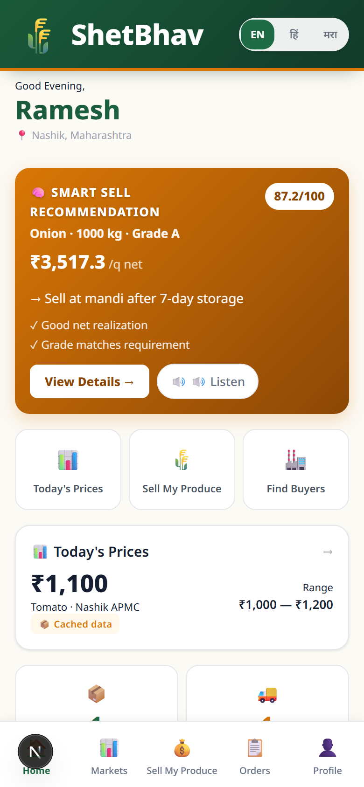
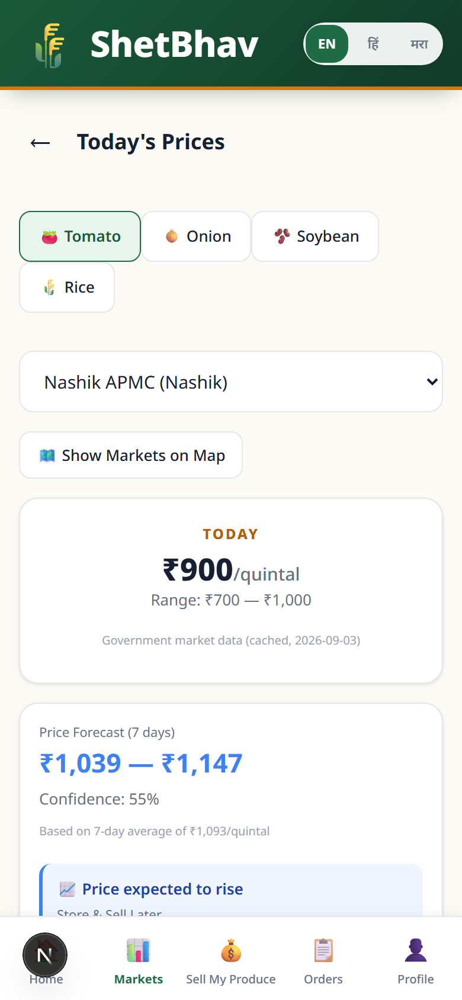
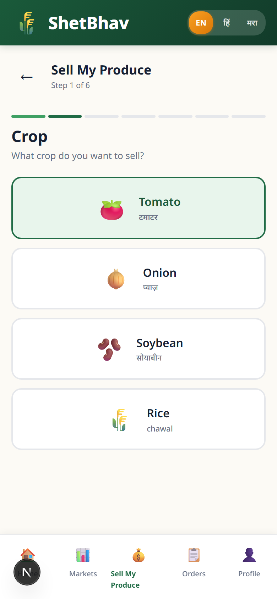
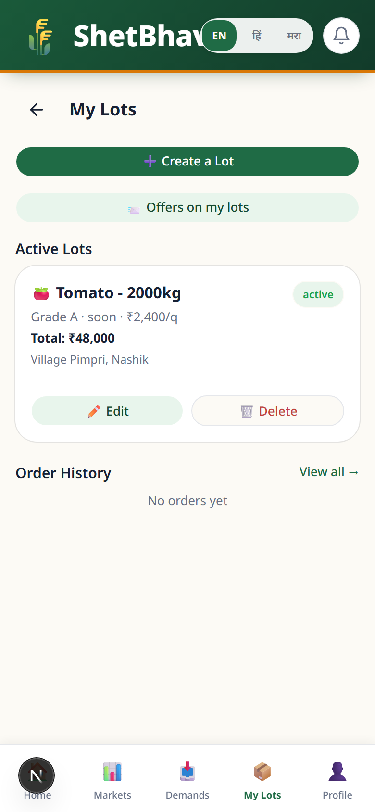
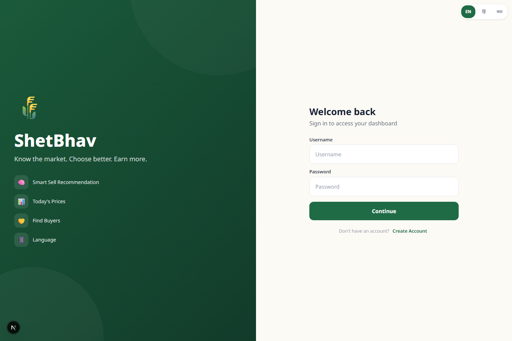
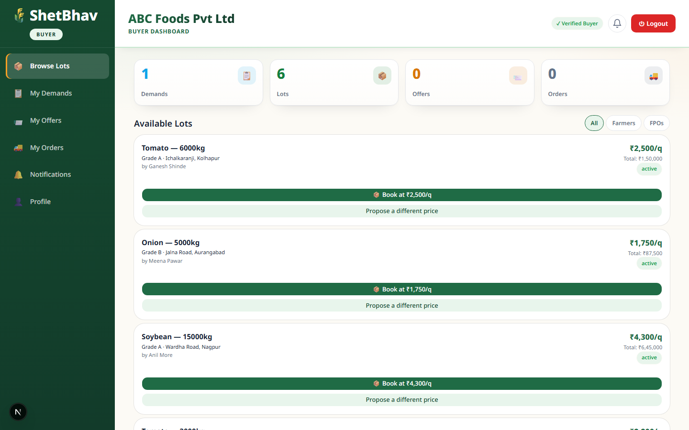
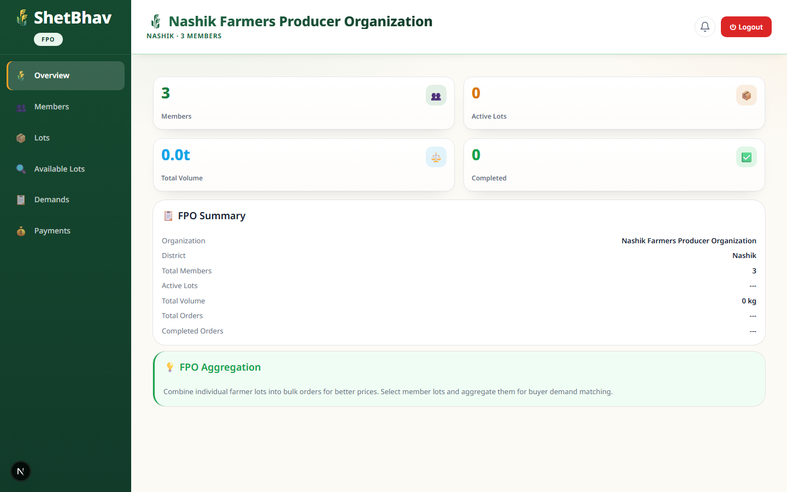
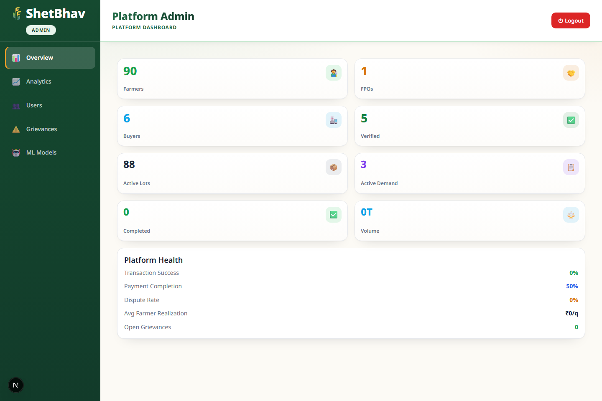
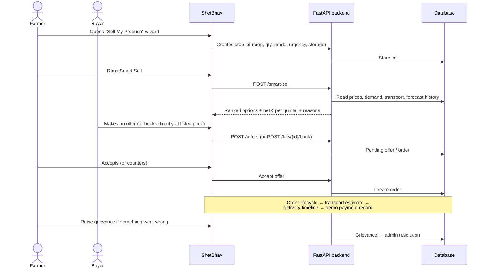

# ShetBhav (शेतभाव)

**Know the market. Choose better. Earn more.**

ShetBhav is a market-intelligence platform that helps Indian farmers decide **where, when, and to whom** to sell their produce — with official mandi prices, buyer demand, and a Smart Sell engine that ranks every selling option by *net* income, not just headline price. The problem statement it tackles originates from Smart India Hackathon 2026 (SIH26132); ShetBhav itself is an independent product built around it.

[](https://www.python.org/)
[](https://fastapi.tiangolo.com/)
[](https://nextjs.org/)
[](https://www.typescriptlang.org/)
[](#testing--ci)
[](#license)

---

<details>
<summary>📑 Table of contents</summary>

- [What is ShetBhav?](#what-is-shetbhav)
- [Live demo](#live-demo)
- [Screenshots](#screenshots)
- [Key features](#key-features)
- [Real market data & the local ledger](#real-market-data--the-local-ledger)
- [Architecture](#architecture)
- [How a sale flows end-to-end](#how-a-sale-flows-end-to-end)
- [Tech stack](#tech-stack)
- [Running locally](#running-locally)
- [Environment variables](#environment-variables)
- [Project structure](#project-structure)
- [Testing & CI](#testing--ci)
- [Deployment](#deployment)
- [Documentation](#documentation)
- [What's real vs. what's simulated](#whats-real-vs-whats-simulated)
- [API overview](#api-overview)
- [License](#license)

</details>

---

## What is ShetBhav?

**ShetBhav (शेतभाव)** — *Know the market. Choose better. Earn more.*

A farmer who sells at whichever mandi is nearest often leaves money on the table: another market 40 km away, a direct buyer, or two weeks of cold storage could have paid more. ShetBhav closes that information gap with five connected capabilities:

1. **Official market data** — daily mandi prices from the government's data.gov.in AGMARKNET feed, every price card labelled by source and date, so farmers always know what they're looking at.
2. **Smart Sell engine** — scores every selling option on *net* income after transport, storage, handling, and spoilage, then explains each recommendation in plain language with risks and confidence.
3. **Full marketplace** — farmers list crop lots → buyers make offers → negotiate → accept → order tracking → payment records, with a complete notification trail.
4. **FPO aggregation** — Farmer Producer Organizations combine member lots for bulk buyer demands and automatically split payments by quantity share.
5. **AI-assisted quality grading** (prototype) — computer-vision estimate for Tomato, Onion, and Soybean, always labelled "AI-assisted estimate", never "certified grade".

Plus **7-day price forecasting** (XGBoost with automatic baseline fallback when data is thin).

Everything works in **English, Hindi (हिंदी), and Marathi (मराठी)** — switchable live in the UI — with a distinct experience per role:

| Role | Experience |
|---|---|
| 👨‍🌾 **Farmer** | Mobile-first app: prices, Smart Sell wizard (6 steps), lots management, orders tracking, earnings, AI-grade photos, grievances, FPO membership |
| 🏭 **Buyer** | Desktop dashboard: browse lots (farmers/FPOs), post demands, make/counter offers, orders, payments, profile management |
| 🌾 **FPO** | Collective dashboard: overview stats, members (approve/reject/remove), lots, available-lot aggregation, demand fulfilment, payment distribution |
| ⚙️ **Admin** | Platform dashboard: users, buyer verification, grievance resolution, ML model status, platform analytics, market-data sync |

---

## Live Demo

🔗 **Frontend**: [market-intelligence-for-farmer.vercel.app](https://market-intelligence-for-farmer.vercel.app/)
🔗 **Backend**: [shetbhav-backend.onrender.com](https://shetbhav-backend.onrender.com/)
🔗 **API Docs**: [shetbhav-backend.onrender.com/docs](https://shetbhav-backend.onrender.com/docs)

> The backend runs on Render's free tier and sleeps after inactivity — the first request can take ~50 seconds to wake it. If login stalls once, retry; it stays fast afterwards.

### Demo Accounts

All demo accounts use password: `demo123`

| Role | Username | Dashboard | Description |
|------|----------|-----------|-------------|
| 👨‍🌾 **Farmer** | `ramesh` | `/farmer` | Ramesh Patil — Nashik farmer with active lots and earnings |
| 🏭 **Buyer** | `abc_foods` | `/buyer` | ABC Foods — verified buyer with demands and orders |
| 🌾 **FPO** | `nashik_fpo` | `/fpo` | Nashik FPO — farmer producer organization with members |
| ⚙️ **Admin** | `admin` | `/admin` | Platform administrator with full management access |

### Quick Start

1. Open [market-intelligence-for-farmer.vercel.app](https://market-intelligence-for-farmer.vercel.app/)
2. Click **Login** (or go to `/login`)
3. Enter username (e.g., `ramesh`) and password (`demo123`)
4. Click **Sign In** — your role is detected automatically, no role selection needed
5. Explore the dashboard for your role

---

## Screenshots

Captures from the running app (Sept 2026). Farmers get a phone-first flow; buyers, FPOs, and admins get desktop dashboards.

**📱 Farmer — mobile**
| Home & Smart Sell | Market prices | Sell wizard | My lots |
|---|---|---|---|
|  |  |  |  |

**🖥️ Role dashboards — desktop**

| Login | Buyer | FPO | Admin |
|---|---|---|---|
|  |  |  |  |

---

## Key features

### 🎯 Smart Sell Decision Engine
- **6-step wizard**: Crop → Quantity → Quality → Urgency → Storage → Results
- **8 weighted factors**: net realisation (30%), price advantage (15%), transport cost (10%), buyer demand (10%), quality match (10%), payment reliability (10%), timing (10%), distance (5%)
- **Best option + 6 alternatives + 3 What-If scenarios** (sell now vs. store vs. different market)
- **Net realisation** = gross price − transport − storage − handling − spoilage − charges
- Confidence scores and plain-language reasons/risks for every option

### 📊 Real Market Intelligence
- **Official AGMARKNET data** from data.gov.in with source badges (live / imported / synthetic)
- **7-day price forecast** (XGBoost with automatic baseline fallback when history is thin)
- **Leaflet map** of Maharashtra mandis for visual market selection
- **1,469 real price records** (74 mandis, 4 commodities, Jun–Sep 2026) survive restarts via the local ledger — see below

### 🤝 Full Marketplace Flow
- **Lots**: create, edit, withdraw crop lots with price, quality, urgency, storage options
- **Direct booking**: buyers can book-and-pay a lot at its listed price, no negotiation needed
- **Offers**: buyers propose prices → farmers accept/counter/reject; counter-offer history is preserved
- **Orders**: full lifecycle — created → accepted → pickup → in-transit → delivered → quality confirmed → paid → completed
- **Payments**: simulated (clearly labelled "Demo payment tracking") with payment-window enforcement and automatic lot release on expiry
- **Grievances**: file and track disputes with admin resolution

### 🏢 FPO Features
- **Membership lifecycle**: farmers browse/join/leave FPOs (self-service with approval)
- **Member management**: FPO approves/rejects join requests, removes members, views member details
- **Aggregation**: combine member lots into collective lots for bulk buyer demands
- **Payment distribution**: split payments to contributor farmers by quantity share (net of FPO commission + platform fee)

### 🧪 AI-Assisted Quality Grading (Prototype)
- **Crops**: Tomato, Onion, Soybean
- **Image analysis**: colour, uniformity, blemish, and freshness detection
- **Grade output**: A/B/C with confidence score
- **Verification types**: self-declared, AI-assisted, manually verified, lab-verified
- **Always labelled** "AI-assisted estimate" — never "certified grade"

### 🌐 Multilingual & Accessible
- **3 languages**: English, Hindi (हिंदी), Marathi (मराठी) — ~150 UI strings each, switchable live
- **Mobile-first design**: farmer app centred at 420px on desktop too
- **48px minimum touch targets** (WCAG compliant)
- **Colourblind-safe**: status always includes icon + label
- **High contrast**: navy on cream (13:1), white on green (6.4:1)

### 🔐 Security & Auth
- **JWT authentication** with 4 roles (farmer, buyer, FPO, admin)
- **Role-based access control** enforced on every API endpoint
- **bcrypt password hashing**
- **Rate limiting** (disabled in demo mode)
- **Security headers**: X-Content-Type-Options, X-Frame-Options, X-XSS-Protection, Referrer-Policy

---

## Real market data & the local ledger

Market data in ShetBhav is **real government data with honest labels**. The one thing it must never do is silently fake freshness — every price card states where the number came from and how old it is.

**The durability problem.** The backend runs on Render's free tier, where the database is ephemeral: a restart or database recycle wipes every stored price record. Re-fetching from data.gov.in costs API quota and only returns the most recent pages, so history would shrink over time.

**The fix — a local, append-only ledger.** Every real record fetched from the AGMARKNET API (or imported from the bundled CSV) is appended to a committed JSONL file, `shetbhav/backend/data/local_market_ledger.jsonl`. On every startup the ledger is replayed into the database:

- **1,469 real AGMARKNET records** currently in the ledger — 74 Maharashtra mandis, Onion/Tomato/Soybean, 1 Jun – 3 Sep 2026
- After a database wipe, the platform **refills itself from the file** on the next boot — no API calls, no lost history
- Appends are **idempotent** (keyed by crop + mandi + arrival date), so re-fetches never duplicate
- Synthetic demo rows are **never** stored in the ledger; restored rows carry the same `historical_dataset` label as imported data
- Sync totals are visible to admins at `GET /sync/status`

Over time the ledger only grows: each daily sync permanently banks the day's real mandi prices.

---

## Architecture

```
┌────────────────────────────────────────────────┐
│                   Frontend                     │
│  Next.js 16 · TypeScript · Tailwind v4         │
│  shadcn/ui (Base UI) · Zustand · Axios         │
│  24 routes (incl. dynamic) · EN/HI/MR i18n     │
│  Mobile-first (farmer) + desktop (business)    │
└───────────────────┬────────────────────────────┘
                    │ REST API (JSON + JWT)
┌───────────────────▼────────────────────────────┐
│                   Backend                      │
│  FastAPI · Python 3.11 · Pydantic              │
│  105 API methods (94 paths) · JWT auth · RBAC  │
│  9 service modules · ML pipeline               │
└───────────────────┬────────────────────────────┘
                    │
┌───────────────────▼────────────────────────────┐
│                 Database                       │
│  SQLite (dev) · PostgreSQL (Render prod)       │
│  45 tables · SQLAlchemy ORM                    │
│  + local ledger file (survives DB resets)      │
└────────────────────────────────────────────────┘
```

### Backend service modules (9)

1. **Smart Sell** (`services/smart_sell.py`) — 8-factor scoring engine comparing mandi, buyer, storage, and FPO options
2. **Market Data** (`services/market_data.py`) — multi-mode adapter: live → real DB rows → cached → demo, real sources always preferred over synthetic
3. **Market ledger** (`services/market_ledger.py`) — append-only file that banks every real price record and replays it into the DB on startup
4. **data.gov.in client** (`services/data_gov.py`) — AGMARKNET API integration with validation/deduplication
5. **Forecasting** (`ml/forecasting.py`) — XGBoost price prediction with chronological validation
6. **Logistics** (`services/logistics.py`) — Haversine distance, transport/storage cost estimation
7. **FPO aggregation** (`services/fpo_aggregation.py`) — lot combination for bulk demands and payment splitting
8. **Quality grading** (`services/quality_grading.py` + `ml/crop_vision.py`) — rule-based CV analysis
9. **Auth** (`services/auth.py`) — JWT, bcrypt, role verification

### Frontend layers

- **shadcn/ui primitives** (`src/components/ui/`): Button, Card, Badge, Input, Tabs, Carousel
- **App-specific** (`src/components/ui.tsx`): EmptyState, DataSourceBadge, PasswordInput, NotificationBell, NotificationsPanel, ProgressBar, Skeleton
- **Shared**: FarmerHeader, FarmerBottomNav, LangHydrator, MapView (Leaflet/OSM)
- **State**: Zustand stores for auth and i18n; token in `sessionStorage`, language in `localStorage`
- **Layouts**: farmer shell (max 420px, bottom nav) and desktop sidebar shell for buyer/FPO/admin

---

## How a sale flows end-to-end


```mermaid
sequenceDiagram
    actor Farmer
    actor Buyer
    participant App as ShetBhav
    participant API as FastAPI backend
    participant DB as Database

    Farmer->>App: Opens "Sell My Produce" wizard
    App->>API: Creates crop lot (crop, qty, grade, urgency, storage)
    API->>DB: Store lot

    Farmer->>App: Runs Smart Sell
    App->>API: POST /smart-sell
    API->>DB: Read prices, demand, transport, forecast history
    API-->>App: Ranked options + net ₹ per quintal + reasons

    Buyer->>App: Makes an offer (or books directly at listed price)
    App->>API: POST /offers (or POST /lots/{id}/book)
    API->>DB: Pending offer / order

    Farmer->>App: Accepts (or counters)
    App->>API: Accept offer
    API->>DB: Create order

    Note over App, DB: Order lifecycle → transport estimate →<br/>delivery timeline → demo payment record

    Farmer->>App: Raise grievance if something went wrong
    API->>DB: Grievance → admin resolution
```

---

## Tech Stack

### Frontend

| Technology | Version | Purpose |
|------------|---------|---------|
| **Next.js** | 16.3.4 | App Router, React 19 framework |
| **React** | 19.2.8 | UI runtime |
| **TypeScript** | ^5 | Type safety |
| **Tailwind CSS** | ^4 | Utility-first styling (CSS-first config via `@theme`) |
| **shadcn/ui** | ^4.21.0 | UI primitives (built on Base UI, not Radix) |
| **@base-ui/react** | ^1.8.0 | Base UI primitives for shadcn |
| **Zustand** | ^5.0.15 | State management (auth, i18n) |
| **Axios** | ^1.20.0 | HTTP client with auth interceptors |
| **Leaflet** | ^1.9.4 | Map rendering (markets, buyers) |
| **react-leaflet** | ^5.0.0 | React wrapper for Leaflet |
| **recharts** | ^3.10.1 | Admin analytics charts |
| **embla-carousel-react** | ^8.6.0 | Carousel (price cards) |
| **lucide-react** | ^1.41.0 | Icons |
| **Playwright** | ^1.62.1 (dev) | E2E testing |

### Backend

| Technology | Version | Purpose |
|------------|---------|---------|
| **FastAPI** | 0.141.1 | REST API framework |
| **Python** | 3.11+ | Runtime |
| **SQLAlchemy** | >=2.0 | ORM (45 tables) |
| **Pydantic** | >=2.0 | Data validation |
| **python-jose** | (crypto) | JWT signing (HS256) |
| **bcrypt** | >=4.0 | Password hashing |
| **uvicorn** | (standard) | ASGI server |
| **XGBoost** | (ml) | Price forecasting |
| **scikit-learn** | (ml) | ML utilities |
| **pandas / numpy** | (ml) | Data manipulation |
| **joblib** | (ml) | Model persistence |
| **Pillow** | >=10.0 | Image processing (quality grading) |
| **pytest** | >=8.0 (dev) | Test framework |

### Deployment

| Platform | Purpose |
|----------|--------|
| **Vercel** | Frontend hosting (auto-deploy from main) |
| **Render** | Backend + PostgreSQL (auto-deploy from main) |
| **GitHub Actions** | CI/CD (tests, build, E2E) |

---

## Running locally

**Prerequisites:** Node.js 18+ and Python 3.11+.

```bash
# 1) Backend — http://localhost:8000
cd shetbhav/backend
python -m venv .venv && source .venv/bin/activate   # Windows: .venv\Scripts\activate
pip install -r requirements.txt
python -m uvicorn app.main:app --reload --port 8000
```

```bash
# 2) Frontend — http://localhost:3000
cd shetbhav/frontend
npm install
npm run dev
```

Open **http://localhost:3000** → **/login** → use any demo account above.

On first boot the backend **creates the schema, restores the local market ledger (1,469 real records), seeds the four demo accounts, and fills crops/markets automatically** — every startup also idempotently backfills missing reference data. No database setup needed. To re-import the bundled AGMARKNET CSV and retrain forecast models on it, set `IMPORT_HISTORICAL_CSV=true` and `TRAIN_ON_STARTUP=true` on a fresh database (see [ML.md](shetbhav/ML.md)).

---

## Environment Variables

### Backend

Copy [`shetbhav/backend/.env.example`](shetbhav/backend/.env.example) to `.env`:

| Variable | Default | Purpose |
|----------|---------|--------|
| `DATABASE_URL` | `sqlite:///./data/shetbhav.db` | SQLite (dev) / PostgreSQL (prod) |
| `SECRET_KEY` | dev value | JWT signing — **change in production** |
| `FRONTEND_URL` | `http://localhost:3000` | CORS allow-list |
| `DEMO_MODE` | `true` | Disables rate limiting & HSTS; **set false in prod** |
| `DATA_GOV_API_KEY` | (empty) | data.gov.in AGMARKNET API key |
| `DATA_GOV_RESOURCE_ID` | `9ef84268-d588-465a-a308-a864a43d0070` | AGMARKNET dataset resource ID |
| `MARKET_DATA_MODE` | `dataset` | Data source: live/cached/dataset/demo |
| `MARKET_DATA_CACHE_HOURS` | `24` | Cache freshness window |
| `REQUEST_TIMEOUT_SECONDS` | `15` | Upstream API request timeout |
| `MARKET_DATA_LEDGER_PATH` | `backend/data/local_market_ledger.jsonl` | Local ledger file (see [Real market data](#real-market-data--the-local-ledger)) |
| `IMPORT_HISTORICAL_CSV` | `false` | Bootstrap real AGMARKNET history on fresh DB |
| `TRAIN_ON_STARTUP` | `false` | Train/evaluate XGBoost models at startup |
| `AGMARKNET_API_KEY` | falls back to `DATA_GOV_API_KEY` | Alias kept for compatibility |

### Frontend

| Variable | Default | Purpose |
|----------|---------|--------|
| `NEXT_PUBLIC_API_URL` | `http://localhost:8000` | Backend API URL (deployed app uses Vercel /api rewrite) |

### Security Notes

- **Never commit `.env`** — it's gitignored
- **`SECRET_KEY`** must be changed in production (JWT signing)
- **`DATA_GOV_API_KEY`** is optional — without it, data is labelled as synthetic/demo
- **`DEMO_MODE=true`** disables production hardening (rate limiting, HSTS) — set to `false` for production

---

## Project structure

```
market-intelligence-for-farmer/
├── README.md                      This file
├── LICENSE                        MIT
├── render.yaml                    Render Blueprint (backend + PostgreSQL)
├── screenshots/                   UI captures (8 images)
├── .github/workflows/ci.yml       CI: backend tests + frontend typecheck/build + Playwright E2E
└── shetbhav/
    ├── ARCHITECTURE.md            System design, data flow, DB schema
    ├── API.md                     REST API reference
    ├── DATA_SOURCES.md            AGMARKNET integration, local ledger & data labelling
    ├── DESIGN.md                  Design system & accessibility
    ├── DEMO.md                    Guided demo walkthrough
    ├── LIMITATIONS.md             Honest scope assessment
    ├── ML.md                      Forecasting pipeline & model status
    ├── PROJECT_STATUS.md          Feature status & metrics
    ├── SECURITY.md                Secrets management & hardening checklist
    ├── TESTING.md                 Test matrix & results
    ├── backend/
    │   ├── app/
    │   │   ├── main.py            FastAPI app (105 methods / 94 paths, startup seeding)
    │   │   └── scripts/
    │   │       └── import_market_data.py  CSV import tool (also mirrors to the ledger)
    │   ├── config/
    │   │   ├── database.py        DB engine + session
    │   │   └── settings.py        Environment config
    │   ├── services/              9 service modules (see Architecture)
    │   ├── ml/                    ML pipeline
    │   │   ├── forecasting.py     XGBoost prediction + baselines
    │   │   ├── crop_vision.py     Rule-based CV analysis
    │   │   ├── baselines.py       Naive + moving average baselines
    │   │   ├── evaluation.py      MAE, RMSE, MAPE metrics
    │   │   ├── feature_engineering.py Feature extraction
    │   │   ├── model_training.py  Model training + persistence
    │   │   └── model_registry.py  Model status tracking
    │   ├── models/
    │   │   ├── database.py        45 SQLAlchemy tables + enums
    │   │   └── schemas.py         Pydantic request/response schemas
    │   ├── tests/                 14 test files · 262 tests
    │   ├── data/
    │   │   ├── local_market_ledger.jsonl      1,469 real AGMARKNET records (tracked in git)
    │   │   ├── maharashtra_market_prices.csv  Sample AGMARKNET data
    │   │   └── models/            Trained .joblib models (generated)
    │   └── scripts/
    │       └── e2e_demo.py       Manual E2E demo script (22 steps)
    └── frontend/
        ├── src/
        │   ├── app/               24 routes (App Router)
        │   │   ├── layout.tsx     Root layout with metadata, fonts
        │   │   ├── globals.css    Design system (Tailwind v4 + custom properties)
        │   │   ├── admin/         Admin dashboard
        │   │   ├── buyer/         Buyer dashboard
        │   │   ├── fpo/           FPO dashboard
        │   │   ├── login/         Login (role auto-detected after sign-in)
        │   │   ├── register/      Registration (details → role)
        │   │   ├── farmer/        14 farmer pages (sell wizard, prices, lots,
        │   │   │                  orders, earnings, offers, demands, buyers,
        │   │   │                  FPO, quality, grievance, notifications, profile)
        │   │   ├── demands/[id]/  Demand detail (shared)
        │   │   ├── lots/[id]/     Lot detail (shared)
        │   │   └── profile/[userId]/ Counterparty profile (shared)
        │   ├── components/
        │   │   ├── ui/            shadcn/ui primitives actually used
        │   │   │                  (button, card, badge, input, tabs, carousel)
        │   │   ├── ui.tsx         App-specific components
        │   │   ├── FarmerHeader.tsx    Green sticky header
        │   │   ├── FarmerBottomNav.tsx Mobile bottom nav
        │   │   ├── LangHydrator.tsx    Language hydration
        │   │   └── MapView.tsx         Leaflet/OSM map
        │   └── lib/
        │       ├── api.ts         Axios client with auth interceptor + cold-start handling
        │       ├── store.ts       Zustand auth store
        │       ├── i18n.ts        Zustand i18n (EN/HI/MR translations)
        │       ├── cropEmoji.ts   Crop → emoji mapping
        │       ├── money.ts       INR formatting + total calculation
        │       └── utils.ts       cn() utility
        ├── e2e/                   Playwright E2E specs (4 files · 15 tests)
        ├── public/                Static assets
        ├── vercel.json            /api rewrite → Render backend
        └── (configs)              next.config.ts, postcss, eslint, tsconfig
```

---

## Testing & CI

### Verified state (September 2026)

**Backend tests (pytest):** 262/262 PASS ✅
```bash
cd shetbhav/backend
python -m pytest tests/ -q
```

**Frontend typecheck & build:** 24 routes, 0 errors ✅
```bash
cd shetbhav/frontend
npx tsc --noEmit && npm run build
```

**Playwright E2E tests:** 15/15 PASS ✅ (requires backend on :8000 + frontend on :3000)
```bash
cd shetbhav/frontend
npx playwright test
```

**Manual E2E demo script:** 22/22 PASS ✅
```bash
cd shetbhav/backend
python scripts/e2e_demo.py        # Runs against a live backend
```

### Backend test matrix (262 tests across 14 files)

| File | Tests | Covers |
|------|-------|--------|
| `test_api.py` | 47 | Auth (login/register/check/me), CRUD, RBAC |
| `test_smart_sell.py` | 16 | Scoring engine, 8 factors, net realization |
| `test_workflows.py` | 27 | Full marketplace: lot→offer→counter→accept→order→payment |
| `test_forecasting.py` | 47 | XGBoost pipeline, baselines, chronological validation |
| `test_data_gov.py` | 15 | AGMARKNET API, key validation, normalization, sync |
| `test_quality_grading.py` | 24 | AI grading, image analysis, verification types |
| `test_fpo_flow.py` | 13 | Join/leave/approve/remove, aggregation, payout |
| `test_booking.py` | 10 | Direct book flow, order creation, payment simulation |
| `test_offers_notifications.py` | 13 | Negotiation, counter-offers, notifications |
| `test_profiles_and_admin.py` | 13 | Profiles + admin endpoints |
| `test_market_ledger.py` | 16 | Ledger append/dedupe, DB restore, real-source gating, price-resolution regressions |
| `test_demand_direct_response.py` | 8 | Demand fulfilment, auto-created lots |
| `test_lot_edit_delete.py` | 8 | Lot CRUD, edit restrictions, withdrawal |
| `test_payment_deadline.py` | 5 | Payment windows, expiry, lot release |
| **Total** | **262** | **All passing** |

### E2E specs (Playwright)

| Spec | Covers |
|------|--------|
| `transaction-loop.spec.ts` | Two-account book-and-pay loop across farmer & buyer UIs |
| `counterparty-detail.spec.ts` | Lot/demand detail pages, counterparty profile navigation |
| `lots-tab-create.spec.ts` | My Lots direct create-lot form |
| `smart-sell-wizard.spec.ts` | Smart Sell wizard → My Lots handoff |

### CI/CD

GitHub Actions (`.github/workflows/ci.yml`) runs three jobs on every push/PR to `main`:
1. **Backend tests** — full pytest suite (262 tests)
2. **Frontend build** — typecheck + production build (lint runs non-blocking; ~180 pre-existing findings)
3. **Playwright E2E** — 15 tests with both servers running

---

## Deployment

| Service | Platform | URL |
|---------|----------|-----|
| **Frontend** | [Vercel](https://vercel.com) | `https://market-intelligence-for-farmer.vercel.app` |
| **Backend** | [Render](https://render.com) | `https://shetbhav-backend.onrender.com` |
| **API Docs** | Render (FastAPI) | `https://shetbhav-backend.onrender.com/docs` |
| **Health Check** | Render | `https://shetbhav-backend.onrender.com/health` |

- **Vercel**: deploys on every push to `main`. The project's **Root Directory must be set to `shetbhav/frontend`** (Project Settings → General) — if it points at the repo root, deploys fail.
- **Render**: `render.yaml` Blueprint provisions the web service + PostgreSQL database and deploys on commit. Free-tier instances sleep between requests — the first call after a break takes ~50 s; the login screen detects this and tells the user to retry.
- **Database resilience**: after any database reset, the local market ledger restores all banked real price records on the next backend boot.
- **UptimeRobot**: pings `/health` every 5 minutes to keep the free Render instance awake.

---

## Documentation

| File | Contents |
|------|----------|
| [ARCHITECTURE.md](shetbhav/ARCHITECTURE.md) | System design, data flow, security model, database schema |
| [API.md](shetbhav/API.md) | REST API reference |
| [ML.md](shetbhav/ML.md) | Forecasting pipeline, model evaluation, quality grading |
| [DESIGN.md](shetbhav/DESIGN.md) | Design system, color palette, typography, components, accessibility |
| [DATA_SOURCES.md](shetbhav/DATA_SOURCES.md) | AGMARKNET integration, local ledger, data modes, source labels |
| [SECURITY.md](shetbhav/SECURITY.md) | Secrets management, auth, threat model, hardening checklist |
| [TESTING.md](shetbhav/TESTING.md) | Test matrix, results, E2E demo flow |
| [DEMO.md](shetbhav/DEMO.md) | Guided walkthrough, demo accounts, talking points |
| [PROJECT_STATUS.md](shetbhav/PROJECT_STATUS.md) | Feature status, metrics, production blockers |
| [LIMITATIONS.md](shetbhav/LIMITATIONS.md) | Honest scope assessment, what works, what needs production work |

### Quick Links

- **API Documentation**: `https://shetbhav-backend.onrender.com/docs` (Swagger UI)
- **Health Check**: `https://shetbhav-backend.onrender.com/health`
- **Demo Credentials**: See [Live Demo](#live-demo) section

---

## What's Real vs. What's Simulated

### ✅ Real (production-grade)

| Feature | Status | Details |
|---------|--------|---------|
| **Mandi prices** | ✅ Real | data.gov.in AGMARKNET API with full source labels (live/imported) |
| **Local data ledger** | ✅ Real | 1,469 banked real records that survive database resets |
| **Smart Sell recommendations** | ✅ Real | Multi-factor scoring on real inputs (prices, transport, demand, quality) |
| **Price forecasting** | ✅ Real | XGBoost vs baseline with chronological validation, auto-fallback when data is thin |
| **Marketplace flow** | ✅ Real | Full lot→offer→counter→accept→order lifecycle with negotiation history preserved |
| **FPO aggregation** | ✅ Real | Member lots combined for bulk demands, payment distribution by quantity share |
| **Quality grading** | ⚠️ Prototype | Rule-based computer vision, labelled "AI-assisted estimate" not "certified" |
| **Auth & security** | ✅ Real | JWT + bcrypt, role-based access control on every endpoint |
| **Notifications** | ✅ Real | In-app notification system for all transaction events |

### ⚠️ Simulated / estimated (clearly labelled)

| Feature | Status | Details |
|---------|--------|--------|
| **Payments** | 🔴 Simulated | "Demo payment tracking — no real money movement" — no payment gateway |
| **Transport quotes** | ⚠️ Estimated | Haversine distance + cost model — not a live transporter API |
| **Storage facilities** | ⚠️ Seeded | Seeded facilities — not real warehouse inventory |
| **Transporters** | ⚠️ Seeded | Seeded transport providers |

### 📊 Data sources

| Source | Records | Label |
|--------|---------|-------|
| data.gov.in AGMARKNET (live fetches) | Grows with each daily sync | "Government market data" |
| Local ledger / imported CSV (1 Jun – 3 Sep 2026) | 1,469 · 74 mandis | "Imported AGMARKNET data" |
| Synthetic fallback | Varies | "Synthetic demo data" |

### 🔮 ML models

| Model | Status | Details |
|-------|--------|---------|
| **XGBoost (Tomato)** | ⚠️ Baseline fallback | Trained but doesn't beat naive persistence yet (thin data) |
| **XGBoost (Onion)** | ⚠️ Baseline fallback | Trained but doesn't beat naive persistence yet |
| **XGBoost (Soybean)** | ❌ No data | No Soybean arrivals in AGMARKNET subset |
| **Quality CV (Tomato/Onion/Soybean)** | ✅ Prototype | Rule-based image analysis, always labelled as estimate |

---

## API overview

The backend exposes **105 methods across 94 paths**. The full reference with request/response examples lives in [API.md](shetbhav/API.md); interactive docs at `/docs`. Highlights:

| Domain | Endpoints | Examples |
|--------|-----------|----------|
| Auth | 5 | `POST /auth/login`, `POST /auth/register`, `GET /auth/me` |
| Farmer & lots | 11 | `POST /lots`, `POST /lots/{id}/book`, `GET /farmers/dashboard` |
| Smart Sell | 1 | `POST /smart-sell` |
| Market data | 5 | `GET /markets/prices`, `GET /markets/overview`, `GET /crops` |
| Forecasting | 3 | `GET /forecasts/predict`, `POST /forecasts/train` (admin) |
| Buyer & demands | 7 | `POST /demand`, `POST /demand/{id}/accept` |
| Offers | 5 | `POST /offers`, `POST /offers/{id}/counter`, `POST /offers/{id}/accept` |
| Orders & payments | 7 | `GET /orders/{id}`, `POST /payments/{order_id}/simulate` |
| FPO | 12 | `GET /fpo/available-lots`, `POST /fpo/aggregate-request` |
| Admin | 6 | `GET /admin/stats`, `PUT /admin/buyers/{id}/verify` |
| Grievances | 3 | `POST /grievances`, `PUT /grievances/{id}/resolve` |
| Quality grading | 8 | `POST /quality/upload/{lot_id}`, `POST /quality/assess/{lot_id}` |
| Logistics | 5 | `GET /logistics/transport-estimate`, `GET /logistics/storage-decision` |
| Data sync | 3 | `POST /sync/mandi` (admin), `GET /sync/status` |
| Notifications | 2 | `GET /notifications`, `POST /notifications/{id}/read` |
| Translations | 1 | `GET /translations/{lang}` |

All protected endpoints require `Authorization: Bearer <token>`.

---

## License

MIT — see [LICENSE](./LICENSE).
